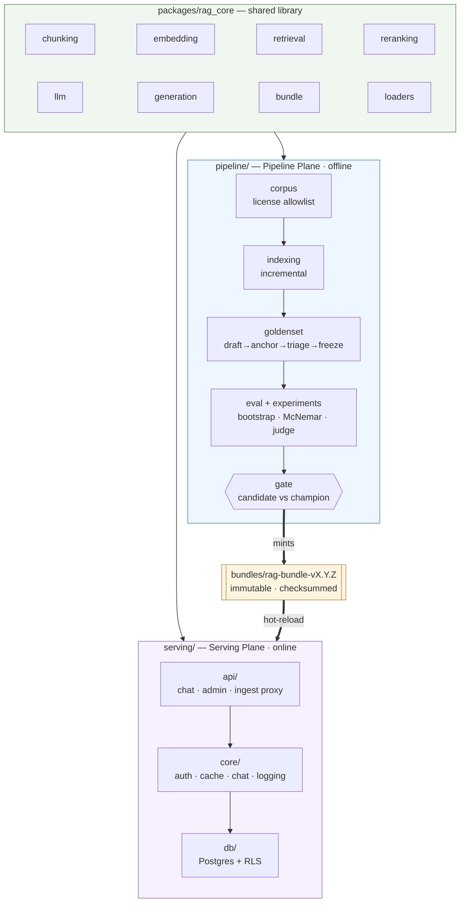
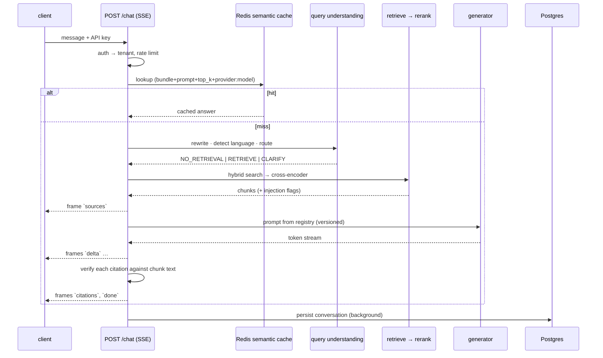

# ARCHITECTURE.md — two planes, one artifact, and the rules that are enforced

*[English] · [`README.md`](README.md) · [`EVALUATION.md`](EVALUATION.md) · [`BUNDLE.md`](BUNDLE.md)*

> The design goal was never "clean layering". It was: **make it impossible to
> change the served system without a measurement, and impossible for a
> measurement to describe something other than what is served.** Everything below
> follows from that one sentence.

---

## 1. The shape

Three code trees, and the arrows only go the way they are drawn.

| tree | may import | may **not** import |
|---|---|---|
| `packages/rag_core/` | third-party libraries only | `pipeline`, `serving` |
| `pipeline/` | `rag_core` | `serving` |
| `serving/` | `rag_core` | `pipeline` |

---

## 2. The rules are a test, not a convention

`tests/unit/test_architecture_boundaries.py` parses every `.py` file in the three
trees with `ast` and fails CI on a violation. Four rules:

1. **`rag_core` imports neither plane.** A shared library that depends upward on a
   plane is no longer shared.
2. **`serving` does not import `pipeline`.** The two planes may only meet through
   the bundle artifact.
3. **`pipeline` does not import `serving`.** The pipeline has to run standalone on
   a rented GPU box where the serving stack does not exist and must not be
   installed.
4. **`rag_core` stays dependency-light at module scope.** `torch`,
   `sentence_transformers`, `transformers`, `qdrant_client` and `docling` must be
   imported *inside functions*. Hoisting one to the top of a file adds tens of
   seconds to `make test` and forces CI to install a GPU stack in order to run
   unit tests.

⭐ Rule 4 has a subtlety the test handles: imports inside `if TYPE_CHECKING:` and
inside function bodies do not count, because neither executes at runtime. Without
that carve-out the rule would forbid type annotations, and a rule that forbids
something reasonable gets disabled.

⚠️ These are AST checks on **import statements**. They cannot see a violation
smuggled through `importlib`, and they are not meant to — the point is to make the
common mistake loud, not to build a sandbox.

---

## 3. Why two planes at all

The two sides have genuinely different requirements, and merging them means the
stricter set wins everywhere:

| | Pipeline Plane | Serving Plane |
|---|---|---|
| lifecycle | runs for hours, restartable, idempotent | runs forever, must not restart |
| hardware | GPU box, possibly rented | CPU or one GPU, always-on |
| dependencies | `docling`, OCR, MLflow, statistics stack | FastAPI, SQLAlchemy, Redis |
| failure mode | job dies → re-run it | request fails → a user sees it |
| secrets | judge/generator API keys | serving API keys, DB credentials |
| correctness bar | reproducible to the digest | available and fast |

A single process holding both has to install `docling` on the serving image (the
image is already 7 GB with torch CUDA), and has to keep evaluation keys where a
web-facing process can read them. Hard constraint #2 — *rented GPU jobs never
carry API keys* — is only expressible because the planes are separate.

---

## 4. The joint: `RagBundle`

Everything the serving plane needs to know about the pipeline's output lives in
one immutable, checksummed, versioned artifact. Full detail in
[`BUNDLE.md`](BUNDLE.md); the architectural points are:

* **The bundle names the Qdrant collection.** Serving never chooses one. Reading
  from a collection the bundle does not name is not possible through the normal
  path.
* **The bundle carries the measurement that justified it** — retrieval metrics,
  generation metrics, the judge model, the golden set version, the git SHA.
  "Which numbers describe production?" is answered by reading the running bundle,
  not by trusting a report's date.
* **Activation is a runtime operation**, not a deploy: `POST /admin/bundle/reload`
  builds a new runtime and swaps it; `POST /admin/bundle/rollback` moves the
  `CURRENT` pointer back.
* **A bundle identity check runs at load** and refuses a bundle whose declared
  model/device/dtype/`max_length` do not match what actually loaded.

⚠️ That identity check has a known blind spot, found in
[`w5-01-generation-eval.md`](plans/reports/tasks/w5-01-generation-eval.md): it does **not**
compare library versions. An image that drifted to `transformers 5.16.1` while the
lockfile pinned `5.15.0` reported `runtime_drift: null` the whole time, and every
retrieval request returned 503 because the cross-encoder loaded with mixed dtypes.
That gap is now closed by an e2e test that asks the running container directly —
the only check in the project connecting "what was measured" to "what is running"
at the library level.

---

## 5. The serving request path

Six SSE frame types: `meta`, `sources`, `delta`, `citations`, `done`, `error`.

⭐ **`sources` and `citations` answer different questions.** `sources` is what was
handed to the model. `citations` is what the model claims it used — *after each
claim was checked against the actual chunk text*. Conflating them turns "the model
said it cited this" into "this was cited", which is the exact failure a citation
feature exists to prevent.

⭐ **The cache key is a namespace, not a hash of the question.** It carries the
bundle version, the prompt version, `top_k`, **and** `provider:model`. The last
field was missing until `W5-11`, and its absence made a generator ablation compare
DeepSeek against itself while every number looked plausible. A fourth axis
(`DEEPSEEK_BASE_URL`) was added in `W6-01` after a stubbed load-test answer was
replayed by a server pointed at the real provider.

---

## 6. Tenant isolation — three layers, and why not one

| layer | mechanism | what it catches |
|---|---|---|
| 1 · token | the API key maps to exactly one `tenant_id`; the request never supplies it | a client asking for someone else's tenant |
| 2 · Qdrant | `tenant_filter()` is applied at query construction | a retrieval path that forgets the filter |
| 3 · Postgres | row-level security, `FORCE ROW LEVEL SECURITY`, on a **non-superuser** role | any query anywhere that forgets `WHERE tenant_id = …` |

⭐ The third layer is the one that changes how code is written: a forgotten
predicate yields **an empty result**, not another tenant's data. The failure mode
becomes visibly wrong instead of invisibly wrong.

⚠️ Two traps that were live and are now closed. The app connects with
`postgres_app_dsn`, not `postgres_dsn` — the image's `POSTGRES_USER` is a
superuser, and **a superuser bypasses RLS entirely**, even `FORCE`. Connecting
with the wrong DSN turns five policies into decoration while every configuration
test stays green. And the tenant is set with `SET LOCAL`, never `SET SESSION`:
connection pools reuse connections, so a leftover session setting hands the next
request the previous tenant — a cross-tenant leak that only appears under load,
i.e. never on a dev machine.

---

## 7. What `/ready` means

`/health` says the process is alive. `/ready` says it can serve correctly, and
returns 503 unless **all three** hold:

1. a bundle is loaded and activated;
2. Qdrant answers a count on the collection the bundle names;
3. the database is at **the migration revision this image expects**.

⭐ Check 3 exists because `SELECT 1` answers "the socket is open", and that is not
how this system fails. It fails as: new image deployed, `alembic upgrade head`
never ran, pod reports ready, takes traffic, and every request dies on
`column … does not exist` — with `SELECT 1` green throughout.

The expected revision is read from the migration folder shipped **in this image**,
not from a constant in code: a constant has to be edited by hand for every new
migration, and the first time someone forgets, the check becomes a check that is
always green.

⚠️ And the skew has **two directions**, which need opposite actions. DB behind code
→ run the migration. DB *ahead* of code → the image is stale; the migration is
already applied and running it does nothing. The second case is the normal
consequence of rolling back the application without rolling back the schema, and
the readiness message names the direction rather than assuming one.

---

## 8. Failure behaviour, deliberately chosen

| situation | behaviour | why not the alternative |
|---|---|---|
| bundle warm-up fails | activation still proceeds | a latency optimisation that turns a transient Qdrant blip into "cannot deploy" trades a small problem for a bigger one |
| rollback | does **not** re-warm | rollback must be the fastest path available; re-warming makes the emergency slower |
| primary LLM down | pinned-slug fallback + circuit breaker + budget cap | silent retries against a paid API are an unbounded bill |
| retrieved chunk looks like prompt injection | flagged, **not** dropped, and the flag reaches the UI | dropping content silently changes what the answer was based on, invisibly |
| citation quote not locatable in the UI | the page prints the quote verbatim and defers to the server's `verified` badge | the alternative is a second copy of the matching rule in JavaScript — two implementations of one security check |
| ingest service reached from a non-loopback host without a token | refused in code | `bind 127.0.0.1` is a CLI flag; one `--host 0.0.0.0` erases it with nothing in the diff |

---

## 9. Observability

* **Langfuse** (self-hosted): one trace per request covering rewrite → retrieve
  (with scores) → rerank → prompt → completion, with cost and tokens per step.
* **Prometheus + Grafana**: the "RAG Health" dashboard at `:3001`.
  ⚠️ Prometheus histograms are **cumulative counters**; reading one directly gave
  `rerank p95 = 9,375 ms` at concurrency 1 because a cold-start sample leaked into
  the window. Every panel and every measurement script reads
  `delta(before, after)`, and there is a test that reconstructs exactly that
  scenario.
* **`rag_scrape_workers`** is a gauge reading `WEB_CONCURRENCY` — the *same*
  variable uvicorn uses. Declaring the worker count in two places would let the
  gauge lie about its own assumption.

---

## 10. Known architectural debts

| id | debt |
|---|---|
| `TD-63` | Reranking is serialised behind a lock, so single-instance throughput is capped at **1.33 req/s** — 91% of `1 / rerank_time`. Measured, not estimated ([`w6-05-loadtest.md`](plans/reports/tasks/w6-05-loadtest.md)). |
| `NEW-10` | No single-flight on a semantic-cache **miss**: N identical concurrent questions produce N paid calls and N reranks. Measured at 8/8; the same questions serialised produce 0 calls ([`w6-05-loadtest.md`](plans/reports/tasks/w6-05-loadtest.md)). |
| `NEW-09` | `rerank_candidates=20` is predicted to give ~3.3 req/s (2.5×) at a measured ranking cost. Needs a new bundle, a re-eval and `make gate` — the prediction is explicitly *not* evidence. |
| `NEW-12` | No request body size cap ([`security-final.md`](plans/reports/tasks/security-final.md) §8). Cannot be fixed in application code: Pydantic only sees the body after it is fully in memory. Belongs at a reverse proxy. |
| `TD-39` | Rate limiting is applied **after** authentication, so unauthenticated traffic passes freely until the auth check. Needs per-IP limiting at the proxy. |

The full list, with measurements, is in
[`plans/CHECKLIST.md`](plans/CHECKLIST.md).
