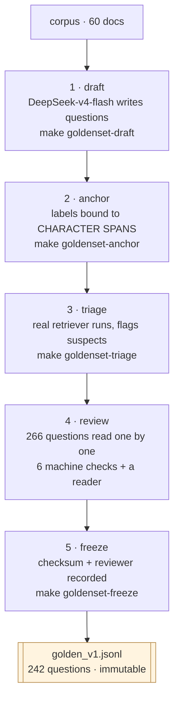

# EVALUATION.md — how the golden set was built, and why its numbers can be trusted

*[English] · [`README.md`](README.md) · [`ARCHITECTURE.md`](ARCHITECTURE.md) · [`BUNDLE.md`](BUNDLE.md)*

> Every number in this repo comes from `golden_v1`. If that set is wrong, every
> table is wrong and no amount of statistical machinery will show it. So this
> document leads with the **weaknesses**, not the method.

---

## 0. The single most important caveat

**`golden_v1` was reviewed by a model, not by a human.** It is recorded in the
data itself, not merely in prose:

```json
{"reviewed_by_human": false, "reviewed_by": "model:claude-opus-5", ...}
```

`freeze` sets `reviewed_by_human=true` **only** when run with `--reviewer human`,
and prints a warning on every run where the reviewer is anything else. That
strictness is deliberate: a wrong boolean here would make the reports, the CV and
the interview answer all say the same false thing, with nothing to catch it.

Consequences, stated plainly:

* Gate `G1` is a **conditional** PASS. The single missing condition is a human
  re-read (`TD-13`).
* What the model reviewer *could* check is anything verifiable **against the
  source text**: does the quote exist, is the category label right, is the
  question self-contained, does the corpus actually fail to answer an
  `unanswerable` question. Those were looked up, not guessed.
* What it *could not* check is "would a real user ask this?" — a product
  judgement.
* If the generator and the reviewer share a blind spot, nothing here detects it.
  The mitigation is that they are **different model families**: DeepSeek-v4-flash
  wrote the questions, Claude Opus 5 reviewed them. It is cross-model, not
  self-grading — but it is not a human.

Full accounting: [`w1-11-review.md`](plans/reports/tasks/w1-11-review.md) §1.

---

## 1. The corpus the questions are about

60 World Bank documents about Vietnam — 40 English, 20 Vietnamese, 14.3M
characters, every one under **CC BY 3.0 IGO** and carrying a `source_url`. The
license allowlist rejects any entry without a source URL or with a license
outside the list, including `ND` (NoDerivatives): chunking plus LLM-generated
context **is** producing a derivative work, so `ND` cannot be waved through.

Two filters had to be added after looking at the real corpus
([`w1-10-goldenset-draft.md`](plans/reports/tasks/w1-10-goldenset-draft.md) §"Chất
lượng corpus"), and one near-duplicate document pair was removed after triage
found it ([`w1-11-triage.md`](plans/reports/tasks/w1-11-triage.md) §4.2) — two
documents that say the same thing make "the relevant document" ambiguous, which
corrupts a label rather than merely adding noise.

---

## 2. How the set was built — five stages, each with its own failure it had to survive



### Stage 1 — draft (`make goldenset-draft`)

DeepSeek-v4-flash reads batches of real chunks and writes questions in seven
categories. It costs money, so it checkpoints: a long paid job with no checkpoint
is a job that charges you twice for one interruption.

⚠️ Four things went wrong on the first real run and are worth knowing before
re-running it: `deepseek-chat` is an **alias**, not a model (so pinning it pins
nothing); a reasoning model made the `max_tokens` diagnosis misleading; running
sequentially wasted an hour; and the job had no checkpoint. All four in
[`w1-10-goldenset-draft.md`](plans/reports/tasks/w1-10-goldenset-draft.md) §"Bốn
phát hiện khi chạy thật".

### Stage 2 — anchor (`make goldenset-anchor`) — the decision the whole set rests on

**Labels anchor to character ranges in the source document, never to `chunk_id`.**

A `chunk_id` here is `{doc_id}::{index}` — purely positional. Change `chunk_size`
by one and every `chunk_id` points at a different passage. A golden set anchored
to `chunk_id` therefore starts measuring the wrong thing **silently** the first
time anyone touches chunking: no error, no failing test, just numbers that no
longer mean what the column header says.

The span is a **provenance range, not a cutting instruction**: it says "the answer
came from here", and the label is re-resolved against whatever chunking the run
under test uses. Proof that the labels survive a chunking change — including a
defect that only appeared at `chunk_size=400` — is in
[`w1-11-spans.md`](plans/reports/tasks/w1-11-spans.md) §§3–5.

### Stage 3 — triage (`make goldenset-triage`)

The real retriever runs over the draft set, and the output is a **review queue**,
not a verdict.

⭐ The design point is **asymmetry**: triage is allowed to say "this looks
suspicious, a human should look", and is not allowed to say "this is fine, skip
it". The threshold that decides suspicion is *calibrated*, not a constant, and
`freeze` does not guess on triage's behalf
([`w1-11-triage.md`](plans/reports/tasks/w1-11-triage.md) §2).

Triage paid for itself immediately: it flagged 15 of 40 `unanswerable` questions
as answerable after all, confirmed that the baseline embedding model is
**monolingual** (which is why `cross_lingual` scored 0 and why no amount of
parameter tuning could have fixed it), found the near-duplicate documents, and
measured that **91% of chunks were being silently truncated at embedding time**.

### Stage 4 — review

266 drafted questions, read one at a time, behind six machine checks that run
first so the reader spends attention on judgement rather than on bookkeeping.
**242 accepted, 24 rejected**, across five distinct rejection reasons:

| category | drafted | accepted | rejected |
|---|---:|---:|---:|
| factoid | 78 | 68 | 10 |
| cross_lingual | 46 | 43 | 3 |
| unanswerable | 40 | 33 | 7 |
| adversarial | 36 | 34 | 2 |
| multi_hop | 34 | 34 | 0 |
| aggregation | 28 | 26 | 2 |
| table_lookup | 4 | 4 | 0 |
| **total** | **266** | **242** | **24** |

⚠️ `table_lookup` has **4 questions**. That is not a small sample, it is an
unmeasurable one — McNemar's `p` is bounded below by `2/2ⁿ`, so a 4-question group
can never reach significance no matter what happens to it. The comparison code
reports this as `INSUFFICIENT POWER`, which is a different outcome from "tie".

### Stage 5 — freeze (`make goldenset-freeze`)

Writes `golden_v1.jsonl` with a checksum, the reviewer identity, and the label
digest. `make goldenset-verify` re-checks the file against that checksum.

⚠️ A bug caught on the real run: `freeze` was **dropping `relevant_spans`** —
the field the entire anchoring design exists to produce
([`w1-11-review.md`](plans/reports/tasks/w1-11-review.md) §5).

---

## 3. What is scored, and what is scored differently

242 questions, but **209** appear in the ranking metrics. The other **33** are
`unanswerable`, and they are measured by **refusal correctness** instead.

This matters more than it looks. An `unanswerable` question has no relevant
document, so `recall@10` for it is not 0 — it is *undefined*. Counting it as 0
would drag every average down by a fixed amount that has nothing to do with
retrieval quality, and would reward a system that retrieves garbage confidently
exactly as much as one that correctly refuses. The metrics therefore return
`None` for those rows, and refusal is scored on its own axis.

---

## 4. Why a comparison between two runs can be trusted

### 4.1 A label digest guards every comparison

Each run records a `relevant_digest` of the labels it used. Comparing two runs
whose digests differ is **rejected**, not warned about — because a label change is
exactly how a comparison table becomes meaningless while continuing to look
perfectly normal.

This is not hypothetical: `cmp-baseline-vs-chunk550.md` shows a comparison where
labels-per-question moved 1.38 → 1.96, and the metric therefore fell 29.5% **even
if retrieval had been identical** — the denominator changed. The report marks it
`KHÔNG SO ĐƯỢC` (not comparable) rather than printing a delta.

### 4.2 Significance testing, not eyeballing

`make eval-compare` runs a **paired** bootstrap with confidence intervals plus
McNemar per metric. `make eval-compare-by BY=lang` scans across groups with
**Bonferroni correction**, because scanning six groups for "the biggest
improvement" and reporting the winner is a max-selection problem, not a
measurement.

Four outcomes, deliberately kept distinct:

| verdict | meaning |
|---|---|
| real difference | CI excludes zero after correction |
| tie | CI includes zero, and the sample could have detected a difference |
| `INCONCLUSIVE` | CI includes zero, but the sample is too small to say "tie" |
| `INSUFFICIENT POWER` | the group can never reach significance at any effect size |

Collapsing the last three into "no difference" is the fastest way to misread a
result — and the reason `W2-09` concludes that **"which category improved most"
has no answer** with 209 questions. It would need roughly 440.

### 4.3 The winner is a set, not a row

`make ablation` prints a 14-cell table *and* an **equivalence set**: every
configuration that cannot be distinguished from the top one. In `W2-08` the
nominal winner was decided by **6 resamples out of 10,000** — reporting it as
"the best configuration" would have been a statement about bootstrap noise.

---

## 5. Generation metrics, and the judge behind them

Retrieval metrics need no model. Generation metrics need a judge, so the judge
itself is measured.

* The judge returns **labels, never scores.** A model asked for "7.5 out of 10"
  produces a number with no defined scale; a model asked "is this claim supported
  by this passage: yes/no" produces something that can be checked against a human.
* **Cohen's κ vs human = 0.7368**, on 50 hand-labelled examples, cross-checked
  against a judge from a different family
  ([`judge-calibration.md`](plans/reports/tasks/judge-calibration.md)).
* ⚠️ **Changing only the judge model moves a metric by 7.5 points** (GLM-5.3-flash
  0.9246 vs DeepSeek reasoning-on 1.0000). Which is why the judge model, its
  temperature and its cache digest are all recorded **inside the bundle**: a
  generation metric without its judge identity is not reproducible.
* Costs are bounded by a `CostBudget` checked **before** each call, and the judge
  cache is content-addressed on SQLite, so a re-run of an unchanged evaluation is
  free.

Current values on `rag-bundle-v0.2.1`: faithfulness **0.9877**, citation coverage
**0.6186**, answer relevancy **0.7479**.

---

## 6. What runs automatically

| when | what | cost |
|---|---|---|
| every PR | `make smoke-eval` — full retrieval stack on a frozen index with pre-computed vectors | **$0**, ~5 s, deterministic |
| every PR | unit + integration tiers | $0 |
| nightly / manual | `make nightly` — candidate bundle → gate vs champion → promote if PASS | API cost, budgeted |

`make smoke-eval` is the gate that `G5` asks for: a pull request that makes
retrieval worse goes red there, without a GPU, an API key or a corpus download.
It replaces **only** the embedder, with a frozen lookup table; every layer above
it is the production code path.

---

## 7. Known limits — the honest list

1. **Model-reviewed, not human-reviewed** (§0). `TD-13` is the one open condition
   of `G1`. The two groups to re-read first are the 33 `unanswerable` and the 43
   `cross_lingual` questions — the two the reviewer rejected most from, i.e. the
   two it was least confident about.
2. **209 questions is enough for overall metrics and not enough for per-group
   claims.** Measured, not assumed: ~440 would be needed.
3. **`table_lookup` (4 questions) is permanently unmeasurable** as a group.
4. **One corpus, one domain.** Every number describes World Bank development
   reports about Vietnam. Nothing here licenses a claim about other domains.
5. **The judge is one model with κ=0.74.** Good agreement, not ground truth.
6. **`G6`'s retrieval targets are not met**: nDCG@10 0.7079 vs a 0.82 target,
   Recall@10 0.8022 vs 0.90. Reported as a gap, not rounded away.

---

## 8. Reproducing any number here

```bash
make up                              # Qdrant + Postgres + Redis
make smoke-eval                      # $0, no GPU, ~5 s — start here

make goldenset-verify                # golden_v1 against its checksum
make eval-retrieval BUNDLE=bgem3 MODE=hybrid RUN=my-run
make eval-compare BASE=baseline CAND=my-run
make ablation                        # 14 cells, per-row p-values and CIs
make gate BUNDLE=0.2.1               # candidate vs champion; exit≠0 on FAIL
```

Every task report under [`plans/reports/tasks/`](plans/reports/) ends with the
exact command that produced its numbers.
