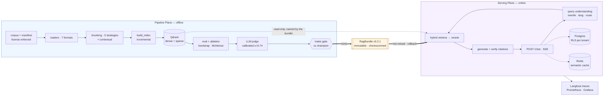

# RAG Platform — a production RAG system for Vietnamese

***English** · [Tiếng Việt](README.vi.md)*

> This started as a Streamlit RAG proof-of-concept and was **rebuilt as a
> production platform**. The POC still runs, lives in [`legacy/`](legacy/), and is
> kept deliberately: it is the **measured baseline** every improvement below is
> compared against.
>
> Progress, engineering decisions and **every number** live in
> [`plans/CHECKLIST.md`](plans/CHECKLIST.md) · session journal in
> [`plans/WORKLOG.md`](plans/WORKLOG.md) · one report per task in
> [`plans/reports/`](plans/reports/README.md).
>
> Note: those engineering journals are written in **Vietnamese** — they are working
> documents, not marketing. This README covers what they contain.

---

## The thesis

Most RAG demos break on the way to production for the same reason: **there is no
way to tell whether a change made the system better or worse.** Change the chunk
size, swap the model, add a reranker — everything "seems better".

This repo is built on three principles, and most of the work went into the second.

**1. Two separate planes, joined by one artifact.** The *Pipeline Plane* (offline:
ingestion, indexing, evaluation, experiments) and the *Serving Plane* (online: user
queries) are two processes, two lifecycles, two dependency sets. They may only be
joined through a versioned, immutable [`RagBundle`](plans/reports/tasks/w4-01-rag-bundle.md).
That boundary is **enforced by a test** — `tests/unit/test_architecture_boundaries.py`
walks the AST and fails CI if `rag_core` imports `pipeline`, or if a heavy dependency
(`torch`, `qdrant_client`) reaches the module level of the core library.

**2. No number is stated without a measurement, and no measurement is trusted
without a significance test.** Comparing two retrieval configurations is a
statistics problem, not a matter of putting two tables side by side: the repo has
paired bootstrap, McNemar, Bonferroni correction when scanning across groups, and
a distinct flag for *"not enough power to conclude"* — which is not the same
thing as *"tie"*.

**3. A guarantee that lives only in a deployment convention is not a guarantee.**
Binding to `127.0.0.1` is erased by one `--host 0.0.0.0` with nothing in the diff.
Where it was affordable, conventions were moved into code and pinned by a test —
see [`security-final.md`](plans/reports/tasks/security-final.md) §5.

---

## How it is verified

**3,119 tests** — 2,548 unit · 412 integration (real Qdrant/Postgres/Redis) · 138
security · 21 e2e (against the real compose stack and the real image). The
default tier and the integration tier both run green in CI on every push;
without `make up-api` the e2e tier skips instead of failing, on purpose. `ruff`
and `mypy` (including `--platform linux`) are clean across 278 source files.
**74 engineering reports**, one per task.

---

## Measured results

The corpus is **60 World Bank documents about Vietnam** (40 English + 20
Vietnamese, 14.3M characters, all CC BY 3.0 IGO). The golden set `golden_v1` has
**242 questions** whose labels are anchored to character spans in those
documents. 209 are scored for ranking; 33 `unanswerable` questions are measured
separately by refusal correctness — they return `None` on every ranking metric
rather than being counted as zero.

### Retrieval

Serving bundle [`rag-bundle-v0.2.1`](bundles/rag-bundle-v0.2.1/manifest.json):
BGE-M3 → hybrid RRF (`k=1`) → cross-encoder rerank over 50 candidates, on
contextual chunks. Same 209 questions, same labels as the baseline, so the two
columns are directly comparable.

| Metric | POC baseline | Current | `G6` target |
|---|---:|---:|---:|
| Recall@10 | 0.2257 | **0.8022** | ≥ 0.90 |
| Recall@5 | 0.1746 | **0.7847** | — |
| nDCG@10 | 0.1621 | **0.7079** | ≥ 0.82 |
| MRR | 0.1660 | **0.7047** | ≥ 0.75 |
| hit_rate@1 | 0.1196 | **0.6220** | — |
| MAP@20 | — | **0.6636** | — |

*Baseline recall: [`cmp-baseline-vs-bgem3.md`](plans/reports/compare/cmp-baseline-vs-bgem3.md)
· baseline nDCG/MRR/hit@1:
[`ablation-exp-001-ndcg.md`](plans/reports/compare/ablation-exp-001-ndcg.md) row
`e1-baseline-dense` · current: the bundle manifest, produced by
`make eval-retrieval` and checked by `make gate`.*

**What the reranker is worth**, from the 14-cell ablation in
[`ablation-exp-001-ndcg.md`](plans/reports/compare/ablation-exp-001-ndcg.md):

| configuration | nDCG@10 |
|---|---:|
| rerank over 50 candidates | **0.6481** |
| rerank over 20 candidates | 0.5823 |
| no rerank — hybrid RRF `k=1` | 0.4563 |

(That table is on non-contextual chunks, which is why its top row is below the
0.7079 above — it isolates one variable at a time.)

### Generation

Scored on the same answer run, by an LLM judge calibrated against hand labels —
Cohen's κ vs human **0.7368** ([`judge-calibration.md`](plans/reports/tasks/judge-calibration.md)).

The "before" column is honest rather than flattering: the POC had **no
evaluation harness at all**, so these numbers were never measured — which is
itself the before state worth recording.

| Metric | POC baseline | Current | Target |
|---|---:|---:|---:|
| Faithfulness (cited claims, n=407) | *never measured* | **0.9877** | ≥ 0.92 — met |
| Citation accuracy (quote level, n=396) | *never measured* | **0.8662** | ≥ 0.85 — met |
| Refusal correctness (220/242) | *never measured* | **0.9091** | ≥ 0.85 — met |
| Citation coverage | *never measured* | 0.6186 | — |
| Answer relevancy | *never measured* | 0.7479 | — |

*Citation accuracy is the post-`NEW-08` rescore of the same 396 quotes — the
earlier 0.8308 contained 19 false rejections by the quote matcher (ellipses
treated as fabricated quotes); fixing the matcher rescued 14, dropped 0
([`probes/new08-td64-rescore.json`](plans/reports/probes/new08-td64-rescore.json)).
Answer relevancy is scored by a judge that has **not** been calibrated against
human labels (`TD-68`) — read it as a trend, not a verdict. Faithfulness's
judge has κ = 0.7368 vs human.*

### Serving

From the load test in [`w6-05-loadtest.md`](plans/reports/tasks/w6-05-loadtest.md),
run against the real stack with the provider call stubbed at the HTTP boundary
and calibrated against 242 real requests:

| | |
|---|---:|
| p95 end-to-end (real DeepSeek) | 4,842 ms |
| **TTFT p95 — the operating SLO, ≤ 2,000 ms at design load** | **1,400 ms** @ u=1 · 2,200 @ u=2 · 4,300 @ u=8 |
| Single-instance throughput ceiling | **1.33 req/s** |
| Failed requests, all concurrency levels | **0** |

**Three things that must be read alongside these tables:**

* **The p95 budget of 3,500 ms is not reachable by optimising retrieval.**
  Removing retrieval and reranking *entirely* — an impossible configuration —
  still leaves 4,055 ms, because 84% of p95 is the provider generating tokens.
  The budget was written before streaming existed and is dominated by answer
  length — a property of the *question*. Decision (2026-09-08): the line stays
  recorded as not met (replacing it would move the goalposts) and the
  **operating SLO is TTFT
  p95 ≤ 2,000 ms at design load** — the number a user of a streaming API
  actually feels, and the one sensitive to what we control. It is observable
  in production as `rag_ttft_seconds` with a bucket edge exactly at 2.0 s.
* **The throughput ceiling is one debt, not a vague scaling limit.** It equals
  91% of `1 / rerank_time`: as concurrency rises, `completion` stays flat at
  4.9 s across six levels while `rerank` walks 975 → 19,364 ms. The system does
  not fall over under load; it slows down.
* **`c=50` is neither the best nor the fastest configuration** — it is the one
  being served. `c=100` scores higher, but `W2-08` measured that the gain is
  *coverage*, not ranking quality (nDCG and MAP move in the **opposite**
  direction). `c=20` was measured and **rejected** (`NEW-09`, 2026-09-08): it
  buys 2.21× retrieval latency but *all 15 metrics* get worse with no CI
  crossing zero — on the contextual-chunk bundle actually being served it keeps
  only 54.8% of the recall@10 gain, not the 91% a sentence measured on a
  different configuration promised.

---

## Architecture



| Directory | Role |
|---|---|
| `packages/rag_core/` | **Core library.** Never imports `pipeline`/`serving`. Heavy dependencies imported lazily. `chunking/` `embedding/` `loaders/` `retrieval/` `reranking/` `llm/` `generation/` `bundle/` |
| `pipeline/` | Pipeline Plane: `corpus/` `indexing/` `goldenset/` `eval/` `experiments/` `ingest/` |
| `serving/` | Serving Plane: `api/` `core/` `db/` + `Dockerfile` |
| `bundles/` | Versioned immutable artifacts + the `CURRENT` pointer |
| `configs/` | Versioned configs for corpus / indexing / experiments |
| `infra/` | compose stacks: platform · metrics · Langfuse |
| `plans/` | `CHECKLIST.md` (source of truth), `WORKLOG.md`, `reports/` |
| `tests/` | `unit/` (80 files) · `integration/` (21) · `security/` (5) · `e2e/` (2) |
| `legacy/` | The Streamlit POC — the comparison baseline, still runnable |

### The API

`POST /chat` (SSE) · `GET /conversations/{id}` · `POST /feedback` ·
`GET /health` · `GET /ready` · `GET /metrics` ·
admin: `POST /admin/bundle/reload` · `POST /admin/bundle/rollback` ·
`GET /admin/feedback` · `GET /admin/llm` · `GET /admin/tracing` ·
`POST /admin/ingest` + `GET /admin/ingest/{job}` (re-index + progress) ·
`POST /admin/ingest/upload` (register a **public** document into the corpus —
license allow-list and public source URL enforced at the gate; it reaches
users only through a freshly built and measured bundle).

Every data endpoint requires an API key. `/ready` is not a liveness probe: it
returns 503 unless the bundle loaded, Qdrant answers, **and** the database is at
the migration revision this image expects.

---

## Getting started

```bash
uv sync --all-extras        # or: make install
make up                     # Qdrant + Postgres + Redis, waits until healthy
make smoke-eval             # ← the whole retrieval stack, on a frozen index
```

That third command is the one worth trying first. It takes about **5 seconds**,
needs **no GPU, no API key and no corpus download**, and prints real retrieval
metrics — the embedder is replaced by a frozen lookup table of pre-computed
vectors, so the run is deterministic and costs **$0**, while every layer above it
is the production code. It is also the gate that makes a PR fail if retrieval
regresses.

```
smoke_mrr              0.8311
smoke_ndcg@10          0.8476
smoke_recall@10        0.9333
smoke eval XANH (tolerance 0.020)
```

**There is no one-command path to the full system, and this README will not
pretend otherwise:** the index is ~20k chunks embedded with BGE-M3, which needs a
GPU and hours. What you can do without one is above; what needs the index is
below.

```bash
make data-pull                 # corpus via DVC (or `make corpus` to re-fetch)
make index BUNDLE=bgem3        # build the index — GPU strongly recommended
make eval-retrieval BUNDLE=bgem3 MODE=hybrid RUN=my-run
make up-api                    # build the image, start the API, wait for /ready
make smoke                     # e2e against the running container
```

**The retrieval evaluation path needs no LLM API at all.** It has been run for
real with empty keys and produced results identical to the run with keys (0.0000%
deviation) — retrieval evaluation must not depend on a paid service.

```bash
make help                   # every target, with descriptions
make lint                   # ruff check + format + mypy
make test                   # unit + security, no Docker needed
make test-integration       # requires `make up`
```

### Worth trying

```bash
make index-dry BUNDLE=bgem3      # chunk a few docs, print stats, never touch Qdrant
make truncation                  # how much text the embedding model silently cuts
make token-probe                 # chunking by characters vs by tokens, on the real corpus
make incr-probe                  # edit one line → how many chunks must be re-embedded
make ablation                    # 14-cell table with per-row p-values and CIs
make gate BUNDLE=0.2.1           # release gate: candidate vs champion, exit≠0 on FAIL
make up-metrics                  # Prometheus + Grafana "RAG Health" at :3001
make up-langfuse                 # self-hosted Langfuse tracing
```

---

## How evaluation works

This is the part that separates the repo from a demo, so it is the part worth
reading closely. The long version is [`EVALUATION.md`](EVALUATION.md).

**Labels are anchored to character spans, not to `chunk_id`.** A `chunk_id` here
is `{doc_id}::{index}` — purely positional. Change `chunk_size` and every
`chunk_id` points at a different passage, so a golden set anchored to `chunk_id`
starts measuring the wrong thing **silently** the first time anyone touches
chunking. Labels therefore anchor to **character ranges in the source document**
and are re-resolved per index.

**A label digest guards every comparison.** Each run records a
`relevant_digest`. Comparing two runs with different labels is **rejected**, not
warned about — because that is exactly how a comparison table becomes meaningless
while still looking perfectly normal.

**Significance testing, not eyeballing.** `make eval-compare` runs a **paired**
bootstrap + CI + McNemar per metric. `make eval-compare-by BY=lang` scans across
groups with **Bonferroni correction**. There are separate flags for
`INSUFFICIENT POWER` (McNemar's `p` is bounded below by `2/2ⁿ`, so a 4-question
group is permanently unmeasurable) and `INCONCLUSIVE` — both distinct from "tie",
and collapsing them together is the fastest way to misread a result.

**The judge is calibrated, and the calibration is a number.** An LLM judge returns
**labels**, never scores, and is scored against 50 hand-labelled examples: Cohen's
κ = **0.7368**, cross-checked against a second judge from a different family.
Swapping the judge model alone moves a metric by 7.5 points — which is why the
judge model, its temperature and its cache digest are all recorded in the bundle.

**The integrity chain is pinned all the way to the parsed text.** The manifest
pins not just the `sha256` of the bytes but also `text_sha256` and a parser
fingerprint — including the version of **every** package that can change the
output, plus the resolved commit SHA of the layout model weights.

---

## A few decisions, with numbers

Each row links to a report containing the measurement, an explicit "what I
deliberately did not do" section, and a table of predictions written **before**
measuring, checked against the outcome.

| | Finding | Report |
|---|---|---|
| `W2-03`<br/>`W2-05` | **Subword vocabulary breaks known-item search**: 25/51 document IDs were unfindable by any branch. The reranker fixes most of it (hit@1 0.098 → 0.549) — and it **beats sparse retrieval** | [`w2-05-reranker.md`](plans/reports/tasks/w2-05-reranker.md) |
| `W2-08` | "Which configuration wins" is a **max-selection problem**, so the answer is a **set**, not a row. The winner was once decided by **6 resamples out of 10,000** | [`w2-08-ablation.md`](plans/reports/tasks/w2-08-ablation.md) |
| `W2-09` | "Which category improved most" **has no answer** with the data available — all 6 groups tie, and still tie without the correction. It needs ~440 questions | [`exp-001-retrieval.md`](plans/reports/tasks/exp-001-retrieval.md) |
| `W3-01` | Inserting a parser between bytes and text **destroys the golden set**: 0/280 spans survive, while `sha256` still matches and no test goes red | [`w3-01-docling-loader.md`](plans/reports/tasks/w3-01-docling-loader.md) |
| `W3-06` | **Characters are not a portable unit**: for the same chunk set, switching tokenizer changes the token count by up to 47%, and the EN↔VI skew **reverses sign** | [`w3-06-token-sizing.md`](plans/reports/tasks/w3-06-token-sizing.md) |
| `W3-07` | Incremental re-indexing is **179.3× faster**; the blast radius of an edit is bounded by the **distance to the next paragraph break** (2.0% → 98.0% reuse) | [`w3-07-incremental-reindex.md`](plans/reports/tasks/w3-07-incremental-reindex.md) |
| `W4-09` | **`sources` and `citations` answer different questions**: what was handed to the model, versus what the model claims it used *after the claim was checked against the text* | [`w4-09-citation-verify.md`](plans/reports/tasks/w4-09-citation-verify.md) |
| `W4-10` | **No threshold separates a paraphrase from a near-identical question with a different answer.** The distributions overlap almost completely (p50 0.8717 vs 0.8659; the worst trap scores 0.9410 — "revenue" vs "expenditure", not one digit apart) | [`w4-10-semantic-cache.md`](plans/reports/tasks/w4-10-semantic-cache.md) |
| `W4-12` | **`k=1` against a non-deterministic model is not a measurement.** The first run showed the old branch leaking 1/11; the same payload, same seed, same `temp=0` leaked nothing. At `k=6`: **8/11 (~73%)** vs **0/22** with the guardrail | [`security-w4.md`](plans/reports/tasks/security-w4.md) |
| `W5-01` | The harness found **two production bugs before it printed a single number** — both made `POST /chat` return 503, and both passed all 13 `W4` items | [`w5-01-generation-eval.md`](plans/reports/tasks/w5-01-generation-eval.md) |
| `W5-11` | **A cache namespace missing one field made an ablation compare a model with itself.** `cache_namespace` carried bundle + prompt + top_k but **not the generating model**, so the GLM arm replayed DeepSeek's answers verbatim while every number looked plausible | [`exp-003-generator.md`](plans/reports/tasks/exp-003-generator.md) |
| `W6-05` | **A load test that calls a real provider is a load test of that provider.** 84% of p95 is provider token generation, so the stub replaces exactly that HTTP call and nothing else — calibrated to within 11%, in the direction known in advance | [`w6-05-loadtest.md`](plans/reports/tasks/w6-05-loadtest.md) |
| `W6-06` | **The log redactor lied about itself**: its docstring cited "a `logger.exception` printing a provider payload" as the reason it is attached to the handler — and that is precisely the case it missed, because the traceback lives in `exc_info`, a *tuple* | [`security-final.md`](plans/reports/tasks/security-final.md) |
| `W6-06` | **A table can never close; a shape can.** A debt asked for a complete Unicode confusables table. Measured: the fold table catches **2/62** single-character homoglyph substitutions; a structural *mixed-script* rule catches **62/62** with no new dependency | [`security-final.md`](plans/reports/tasks/security-final.md) |

---

## Hard constraints

Three rules enforced in code, not by promise:

1. **No OpenRouter presets (`@preset/...`) anywhere on the evaluation path.** A
   preset is server-side configuration that can change without notice, and a
   metric that shifts for untraceable reasons is a useless metric. Always pin an
   explicit slug, `temperature=0`, a fixed seed, and **log the model that
   actually served the request**. Blocked in the LLM client's constructor.
2. **Rented GPU jobs never carry API keys.** Rented machines only run
   self-contained GPU-bound work; anything touching a paid API runs locally.
3. **The corpus must be public and redistributable.** Public repo + public demo +
   third-party rented machine = three publication channels. `LICENSE_ALLOWLIST`
   rejects any entry missing `source_url` or carrying a license outside the list
   — including `ND` (NoDerivatives), because chunking plus LLM-generated context
   **is** creating a derivative work.

---

## The original POC

The Streamlit version in [`legacy/`](legacy/) still runs and is the baseline for
every number above. Some of its bugs are documented on purpose, because they
teach something: a `pickle` cache loaded from a writable directory, a
`config_hash` that **rounded** its parameters so two different configurations
shared one cache entry, and post-processing that merged chunks **across document
boundaries**. That last bug shape reappeared twice more during `W3` — at section
boundaries and at parent boundaries.

## License

**Source code:** MIT — [`LICENSE`](LICENSE).

**The corpus is NOT under MIT** — those are World Bank documents under
**CC BY 3.0 IGO**. Details in [`data/README.md`](data/README.md). The two must be
kept separate: folding them under a single "MIT" line grants others a right I do
not hold.

## Further reading

- [`ARCHITECTURE.md`](ARCHITECTURE.md) — the two planes, the bundle boundary, and what each layer may not do
- [`EVALUATION.md`](EVALUATION.md) — how the golden set was built and why its numbers can be trusted
- [`BUNDLE.md`](BUNDLE.md) — what a `RagBundle` contains, how one is minted, promoted and rolled back
- [`DOCKER-DISK.md`](DOCKER-DISK.md) — why Docker ate 60 GB, and how to get it back
- [`RUNPOD.md`](RUNPOD.md) — running the contextual-retrieval job on a rented GPU, or on an API instead
