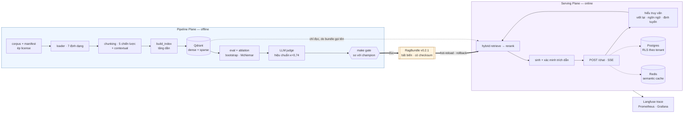

# RAG Platform — nền tảng RAG production cho tiếng Việt

*[English](README.md) · **Tiếng Việt***

> Dự án này bắt đầu từ một POC Streamlit và đã được **viết lại thành một nền tảng
> production**. Bản POC vẫn chạy được, nằm ở [`legacy/`](legacy/), và được giữ lại
> vì nó là **mốc so sánh có số đo** — mọi cải thiện dưới đây đều đo ngược lại nó
> chứ không so với cảm nhận.
>
> Tiến độ, quyết định kỹ thuật và **mọi con số** ở
> [`plans/CHECKLIST.md`](plans/CHECKLIST.md) · nhật ký phiên ở
> [`plans/WORKLOG.md`](plans/WORKLOG.md) · báo cáo từng hạng mục ở
> [`plans/reports/`](plans/reports/README.md).

---

## Luận điểm

Hầu hết demo RAG hỏng khi lên production vì cùng một lý do: **không có cách nào
biết một thay đổi làm hệ thống tốt lên hay tệ đi**. Đổi chunk size, đổi model,
thêm reranker — cái gì cũng "có vẻ tốt hơn".

Repo này dựng trên ba nguyên tắc, và phần lớn công sức nằm ở nguyên tắc thứ hai.

**1. Hai mặt phẳng tách rời, nối nhau bằng đúng một artifact.** *Pipeline Plane*
(offline: nạp dữ liệu, đánh index, đánh giá, thí nghiệm) và *Serving Plane*
(online: câu hỏi của người dùng) là hai tiến trình, hai vòng đời, hai tập phụ
thuộc. Chúng chỉ được nối qua một
[`RagBundle`](plans/reports/tasks/w4-01-rag-bundle.md) bất biến có phiên bản. Ranh
giới ấy **được một bài test canh** — `tests/unit/test_architecture_boundaries.py`
duyệt AST và làm CI đỏ nếu `rag_core` import `pipeline`, hoặc nếu một phụ thuộc
nặng (`torch`, `qdrant_client`) leo lên tầng module của thư viện lõi.

**2. Không con số nào được nêu mà không có phép đo, và không phép đo nào được tin
mà không có kiểm định.** So hai cấu hình truy hồi là một bài toán thống kê, không
phải chuyện đặt hai bảng cạnh nhau: repo có bootstrap ghép cặp, McNemar, hiệu
chỉnh Bonferroni khi quét nhiều nhóm, và một cờ riêng cho *"không đủ lực để kết
luận"* — thứ **không** đồng nghĩa với "hoà".

**3. Một bảo đảm chỉ sống trong quy ước triển khai thì không phải bảo đảm.** Bind
`127.0.0.1` bị xoá sạch bởi một `--host 0.0.0.0`, không để lại gì trong diff. Chỗ
nào trả nổi giá, quy ước được dời vào mã và ghim bằng test — xem
[`security-final.md`](plans/reports/tasks/security-final.md) §5.

---

## Trạng thái

| Giai đoạn | Xong | Gate | Ghi chú |
|---|:---:|:---:|---|
| **W0** · Setup & quyết định | 3/6 | — | 2 đang làm; các mục cần GPU thuê hoãn lại |
| **W1** · Nền móng + baseline eval | **13/13** | 🟡 | PASS **có điều kiện** — golden set do model review, chưa phải người (`TD-13`) |
| **W2** · Nâng cấp truy hồi | **9/9** | 🟡 | p95 đầu-cuối đã đo (`W6-05`); ngân sách **không** đạt — xem dưới |
| **W3** · Ingestion + chunking | 8/9 | ⬜ | còn `W3-09` |
| **W4** · Serving Plane | **13/13** | ✅ | API, auth, SSE, trích dẫn, cache, guardrails, Docker |
| **W5** · Eval đầy đủ + observability | **11/11** | ✅ | eval sinh, LLM judge + hiệu chuẩn, gate phát hành, Langfuse, Prometheus, CI |
| **W6** · Hoàn thiện & trình bày | 2/8 | ⬜ | load test + security pass xong; web UI `[~]`; tài liệu đang làm |

**2.892 test** — 2.351 unit · 382 integration (Qdrant/Postgres/Redis thật) · 138
security · 21 e2e (trên stack compose thật và image thật). Một lượt `pytest` mặc
định khi container API đang chạy: **2.870 xanh, 22 skip**. Không có `make up-api`
thì tầng e2e **skip** chứ không đỏ, và đó là chủ ý. `ruff` và `mypy` (kể cả
`--platform linux`) sạch trên 168 file Python. **60 báo cáo kỹ thuật**, mỗi hạng
mục một bản.

---

## Kết quả đo được

Corpus là **60 tài liệu World Bank về Việt Nam** (40 tiếng Anh + 20 tiếng Việt,
14,3 triệu ký tự, tất cả CC BY 3.0 IGO). Golden set `golden_v1` có **242 câu hỏi**
với nhãn neo vào **khoảng ký tự** trong chính những tài liệu ấy. 209 câu được chấm
xếp hạng; 33 câu `unanswerable` đo riêng bằng độ chính xác của việc từ chối —
chúng trả `None` ở mọi metric xếp hạng chứ không bị tính là 0.

### Truy hồi

Bundle đang phục vụ [`rag-bundle-v0.2.1`](bundles/rag-bundle-v0.2.1/manifest.json):
BGE-M3 → hybrid RRF (`k=1`) → cross-encoder rerank trên 50 ứng viên, trên chunk có
ngữ cảnh. Cùng 209 câu, cùng nhãn với baseline, nên hai cột so trực tiếp được.

| Metric | POC baseline | Hiện tại | Đích `G6` |
|---|---:|---:|---:|
| Recall@10 | 0,2257 | **0,8022** | ≥ 0,90 |
| Recall@5 | 0,1746 | **0,7847** | — |
| nDCG@10 | 0,1621 | **0,7079** | ≥ 0,82 |
| MRR | 0,1660 | **0,7047** | ≥ 0,75 |
| hit_rate@1 | 0,1196 | **0,6220** | — |
| MAP@20 | — | **0,6636** | — |

*Recall baseline: [`cmp-baseline-vs-bgem3.md`](plans/reports/compare/cmp-baseline-vs-bgem3.md)
· nDCG/MRR/hit@1 baseline:
[`ablation-exp-001-ndcg.md`](plans/reports/compare/ablation-exp-001-ndcg.md) dòng
`e1-baseline-dense` · hiện tại: manifest của bundle, sinh bởi `make eval-retrieval`
và kiểm bởi `make gate`.*

**Reranker đáng giá bao nhiêu**, từ bảng ablation 14 ô trong
[`ablation-exp-001-ndcg.md`](plans/reports/compare/ablation-exp-001-ndcg.md):

| cấu hình | nDCG@10 |
|---|---:|
| rerank trên 50 ứng viên | **0,6481** |
| rerank trên 20 ứng viên | 0,5823 |
| không rerank — hybrid RRF `k=1` | 0,4563 |

(Bảng ấy chạy trên chunk **không** có ngữ cảnh, nên dòng đầu của nó thấp hơn con số
0,7079 bên trên — nó cô lập từng biến một.)

### Sinh câu trả lời

Chấm trên cùng một answer run, bằng một LLM judge đã hiệu chuẩn với nhãn tay —
Cohen's κ so với người **0,7368**
([`judge-calibration.md`](plans/reports/tasks/judge-calibration.md)).

| Metric | Giá trị |
|---|---:|
| Faithfulness | **0,9877** |
| Citation coverage | 0,6186 |
| Answer relevancy | 0,7479 |

### Phục vụ

Từ load test trong [`w6-05-loadtest.md`](plans/reports/tasks/w6-05-loadtest.md),
chạy trên stack thật với lời gọi nhà cung cấp được thay bằng stub **đúng ở biên
HTTP**, hiệu chỉnh theo 242 request thật:

| | |
|---|---:|
| p95 đầu-cuối (DeepSeek thật) | 4.842 ms |
| Trần thông lượng một instance | **1,33 req/s** |
| Request hỏng, mọi bậc đồng thời | **0** |

**Ba điều phải đọc kèm những bảng trên:**

* **Ngân sách p95 3.500 ms không đạt được bằng cách tối ưu truy hồi.** Bỏ **toàn
  bộ** truy hồi và rerank — một cấu hình không tưởng — vẫn còn 4.055 ms, vì 84%
  của p95 là thời gian nhà cung cấp sinh token.
* **Trần thông lượng là **một** món nợ cụ thể, không phải một giới hạn mơ hồ.** Nó
  bằng 91% của `1 / thời-gian-rerank`: khi độ đồng thời tăng, `completion` đứng yên
  ở 4,9 s suốt sáu bậc trong khi `rerank` đi 975 → 19.364 ms. Hệ thống **không
  sập** dưới tải, nó chậm lại.
* **`c=50` không phải cấu hình tốt nhất, cũng không nhanh nhất** — nó là cấu hình
  đang được phục vụ. `c=100` điểm cao hơn, nhưng `W2-08` đo được phần hơn ấy là
  **độ phủ**, không phải chất lượng xếp hạng (nDCG và MAP đi **ngược** chiều).
  `c=20` rẻ hơn 4,21× và đang là một đề xuất còn mở (`NEW-09`).

---

## Kiến trúc



| Thư mục | Vai trò |
|---|---|
| `packages/rag_core/` | **Thư viện lõi.** Không bao giờ import `pipeline`/`serving`. Phụ thuộc nặng import lazy. `chunking/` `embedding/` `loaders/` `retrieval/` `reranking/` `llm/` `generation/` `bundle/` |
| `pipeline/` | Pipeline Plane: `corpus/` `indexing/` `goldenset/` `eval/` `experiments/` `ingest/` |
| `serving/` | Serving Plane: `api/` `core/` `db/` + `Dockerfile` |
| `bundles/` | Artifact bất biến có phiên bản + con trỏ `CURRENT` |
| `configs/` | Config có phiên bản cho corpus / indexing / experiments |
| `infra/` | Ba stack compose: platform · metrics · Langfuse |
| `plans/` | `CHECKLIST.md` (nguồn sự thật), `WORKLOG.md`, `reports/` |
| `tests/` | `unit/` (80 file) · `integration/` (21) · `security/` (5) · `e2e/` (2) |
| `legacy/` | POC Streamlit — mốc so sánh, vẫn chạy được |

### API

`POST /chat` (SSE) · `GET /conversations/{id}` · `POST /feedback` ·
`GET /health` · `GET /ready` · `GET /metrics` ·
admin: `POST /admin/bundle/reload` · `POST /admin/bundle/rollback` ·
`GET /admin/feedback` · `GET /admin/llm` · `GET /admin/tracing`.

Mọi endpoint dữ liệu đều đòi khoá API. `/ready` **không** phải liveness probe: nó
trả 503 trừ khi bundle đã nạp, Qdrant trả lời, **và** database đang ở đúng
revision migration mà image này cần.

---

## Bắt đầu

```bash
uv sync --all-extras        # hoặc: make install
make up                     # Qdrant + Postgres + Redis, đợi tới khi healthy
make smoke-eval             # ← toàn bộ stack truy hồi, trên index đóng băng
```

Lệnh thứ ba là lệnh đáng thử trước nhất. Nó mất khoảng **5 giây**, **không cần
GPU, không cần khoá API, không cần tải corpus**, và in ra metric truy hồi thật —
bộ embedding được thay bằng một bảng tra vector tính sẵn, nên lượt chạy là **tất
định** và tốn **$0**, còn mọi tầng phía trên nó là mã production. Nó cũng chính là
cổng làm một PR đỏ khi truy hồi tụt.

```
smoke_mrr              0.8311
smoke_ndcg@10          0.8476
smoke_recall@10        0.9333
smoke eval XANH (dung sai 0.020)
```

**Không có đường một lệnh tới hệ thống đầy đủ, và README này sẽ không vờ là có:**
index là ~20 nghìn chunk nhúng bằng BGE-M3, cần GPU và vài giờ. Thứ chạy được
không cần GPU nằm bên trên; thứ cần index nằm bên dưới.

```bash
make data-pull                 # corpus qua DVC (hoặc `make corpus` để tải lại từ nguồn)
make index BUNDLE=bgem3        # build index — rất nên có GPU
make eval-retrieval BUNDLE=bgem3 MODE=hybrid RUN=my-run
make up-api                    # build image, bật API, đợi /ready xanh
make smoke                     # e2e trên container đang chạy
```

**Đường eval truy hồi không cần một API LLM nào cả.** Nó đã được chạy thật với
khoá rỗng và cho kết quả **giống hệt** lượt chạy có khoá (lệch 0,0000%) — eval
truy hồi không được phép phụ thuộc vào một dịch vụ trả tiền.

```bash
make help                   # mọi target, kèm mô tả
make lint                   # ruff check + format + mypy
make test                   # unit + security, không cần Docker
make test-integration       # cần `make up`
```

### Đáng thử

```bash
make index-dry BUNDLE=bgem3      # chunk thử vài tài liệu, in thống kê, không chạm Qdrant
make truncation                  # model embedding cắt mất bao nhiêu text
make token-probe                 # chunk theo ký tự và theo token, trên corpus thật
make incr-probe                  # sửa một dòng → bao nhiêu chunk phải nhúng lại
make ablation                    # bảng 14 ô, p-value và CI từng dòng
make gate BUNDLE=0.2.1           # gate phát hành: ứng viên vs champion, exit≠0 khi FAIL
make up-metrics                  # Prometheus + Grafana "RAG Health" ở :3001
make up-langfuse                 # Langfuse tự dựng
```

---

## Đánh giá hoạt động thế nào

Đây là phần tách repo này khỏi một bản demo, nên đây là phần đáng đọc kỹ. Bản đầy
đủ ở [`EVALUATION.md`](EVALUATION.md).

**Nhãn neo vào khoảng ký tự, không neo vào `chunk_id`.** `chunk_id` ở đây là
`{doc_id}::{index}` — thuần vị trí. Đổi `chunk_size` thì mọi `chunk_id` trỏ vào một
đoạn khác, nên một golden set neo theo `chunk_id` bắt đầu đo sai **âm thầm** ngay
lần đầu ai đó chạm vào chunking. Vì thế nhãn neo vào **khoảng ký tự trong tài liệu
gốc** và được phân giải lại theo từng index.

**Một digest nhãn canh mọi phép so.** Mỗi lượt chạy ghi một `relevant_digest`. So
hai lượt có nhãn khác nhau bị **từ chối**, không phải cảnh báo — vì đó đúng là cách
một bảng so sánh trở nên vô nghĩa trong khi vẫn trông hoàn toàn bình thường.

**Kiểm định, không phải nhìn bằng mắt.** `make eval-compare` chạy bootstrap **ghép
cặp** + CI + McNemar cho từng metric. `make eval-compare-by BY=lang` quét theo nhóm
với **hiệu chỉnh Bonferroni**. Có cờ riêng cho `INSUFFICIENT POWER` (`p` của McNemar
bị chặn dưới bởi `2/2ⁿ`, nên một nhóm 4 câu là **vĩnh viễn** không đo được) và
`INCONCLUSIVE` — cả hai khác "hoà", và gộp chúng lại là cách nhanh nhất để đọc sai
một kết quả.

**Judge được hiệu chuẩn, và phép hiệu chuẩn là một con số.** Judge trả **nhãn**,
không bao giờ trả điểm, và được chấm lại trên 50 mẫu gán tay: Cohen's κ =
**0,7368**, đối chứng chéo bằng một judge khác họ. Chỉ đổi model judge thôi đã làm
một metric dịch **7,5 điểm** — đó là lý do model judge, nhiệt độ của nó và digest
cache của nó đều được ghi **trong bundle**.

**Chuỗi toàn vẹn ghim tới tận văn bản đã parse.** Manifest ghim không chỉ `sha256`
của bytes mà cả `text_sha256` và một dấu vân của bộ parse — gồm phiên bản của **mọi**
gói có thể đổi kết quả, cộng commit SHA đã phân giải của trọng số model layout.

---

## Vài quyết định, kèm số

Mỗi dòng dẫn tới một báo cáo có phép đo, một mục "cố ý **không** làm gì" và một
bảng dự đoán viết **trước** khi đo, đối chiếu với kết quả.

| | Phát hiện | Báo cáo |
|---|---|---|
| `W2-03`<br/>`W2-05` | **Từ vựng subword phá known-item search**: 25/51 mã tài liệu không nhánh nào tìm ra. Reranker vá được phần lớn (hit@1 0,098 → 0,549) — và nó **thắng cả truy hồi sparse** | [`w2-05-reranker.md`](plans/reports/tasks/w2-05-reranker.md) |
| `W2-08` | "Cấu hình nào thắng" là bài toán **chọn cực đại**, nên câu trả lời là một **tập**, không phải một dòng. Người thắng từng được quyết bởi **6 lần lấy mẫu trên 10.000** | [`w2-08-ablation.md`](plans/reports/tasks/w2-08-ablation.md) |
| `W2-09` | "Nhóm nào cải thiện nhiều nhất" **không có câu trả lời** với dữ liệu đang có — cả 6 nhóm hoà, và hoà cả khi bỏ hiệu chỉnh. Cần ~440 câu | [`exp-001-retrieval.md`](plans/reports/tasks/exp-001-retrieval.md) |
| `W3-01` | Chèn một bộ parse giữa bytes và text **phá huỷ golden set**: 0/280 span sống sót, trong khi `sha256` vẫn khớp và không test nào đỏ | [`w3-01-docling-loader.md`](plans/reports/tasks/w3-01-docling-loader.md) |
| `W3-06` | **Ký tự không phải đơn vị mang đi được**: cùng một tập chunk, đổi tokenizer làm số token lệch tới 47%, và độ chênh EN↔VI **đổi dấu** | [`w3-06-token-sizing.md`](plans/reports/tasks/w3-06-token-sizing.md) |
| `W3-07` | Đánh index lại tăng dần **nhanh 179,3×**; và bán kính ảnh hưởng của một lần sửa bị chặn bởi **khoảng cách tới dấu ngắt đoạn kế tiếp** (2,0% → 98,0% tái dùng) | [`w3-07-incremental-reindex.md`](plans/reports/tasks/w3-07-incremental-reindex.md) |
| `W4-09` | **`sources` và `citations` trả lời hai câu khác nhau**: cái đã đưa cho model, so với cái model tuyên bố đã dùng — *sau khi đối chiếu tuyên bố ấy với văn bản* | [`w4-09-citation-verify.md`](plans/reports/tasks/w4-09-citation-verify.md) |
| `W4-10` | **Không tồn tại ngưỡng tách paraphrase khỏi câu gần giống nhưng đổi đáp án.** Hai phân bố chồng nhau gần hết (p50 0,8717 vs 0,8659; bẫy cao nhất 0,9410 — "Thu" vs "Chi ngân sách", không khác một chữ số nào) | [`w4-10-semantic-cache.md`](plans/reports/tasks/w4-10-semantic-cache.md) |
| `W4-12` | **`k=1` với model không tất định KHÔNG phải một phép đo.** Lần chạy đầu cho nhánh cũ rò 1/11; đúng payload ấy, cùng seed, cùng `temp=0` → không rò. Đo lại `k=6`: **8/11 (~73%)** so với **0/22** khi có hàng rào | [`security-w4.md`](plans/reports/tasks/security-w4.md) |
| `W5-01` | Harness tìm ra **hai lỗi production trước khi in được con số nào** — cả hai làm `POST /chat` trả 503, cả hai lọt qua 13 hạng mục `W4` | [`w5-01-generation-eval.md`](plans/reports/tasks/w5-01-generation-eval.md) |
| `W5-11` | **Một namespace cache thiếu một trường làm bảng ablation so một model với chính nó.** `cache_namespace` mang bundle + prompt + top_k nhưng **không** mang model sinh, nên nhánh GLM nhận lại nguyên văn câu trả lời của DeepSeek trong khi mọi số trông đều hợp lý | [`exp-003-generator.md`](plans/reports/tasks/exp-003-generator.md) |
| `W6-05` | **Một load test gọi nhà cung cấp thật là một load test đo nhà cung cấp ấy.** 84% của p95 là thời gian sinh token, nên stub thay **đúng** lời gọi HTTP đó và không thay gì khác — hiệu chỉnh sai số 11%, theo hướng biết trước | [`w6-05-loadtest.md`](plans/reports/tasks/w6-05-loadtest.md) |
| `W6-06` | **Bộ che log nói dối về chính nó**: docstring của nó lấy "một `logger.exception` in payload của provider" làm lý lẽ biện minh cho việc gắn nó lên handler — và đó đúng là ca nó bỏ lọt, vì traceback nằm trong `exc_info`, một *tuple* | [`security-final.md`](plans/reports/tasks/security-final.md) |
| `W6-06` | **Một bảng không bao giờ đóng được; một hình dạng thì có.** Một món nợ đòi bảng Unicode confusables đầy đủ. Đo được: bảng gập bắt **2/62** phép thay một chữ, còn luật **trộn hệ chữ** bắt **62/62** với 0 phụ thuộc mới | [`security-final.md`](plans/reports/tasks/security-final.md) |

---

## Ràng buộc cứng

Ba luật được ép trong mã, không phải bằng lời hứa:

1. **Không dùng OpenRouter preset (`@preset/...`) ở bất kỳ đâu trên đường eval.**
   Preset là cấu hình phía máy chủ, có thể đổi mà không báo, và một metric dịch đi
   vì lý do không truy được là một metric vô dụng. Luôn ghim slug tường minh,
   `temperature=0`, seed cố định, và **log model thực tế đã phục vụ request**. Chặn
   ngay trong constructor của LLM client.
2. **Job trên GPU thuê không bao giờ mang khoá API.** Máy thuê chỉ chạy công việc
   GPU-bound tự chứa; mọi thứ chạm API trả tiền chạy ở máy nhà.
3. **Corpus phải công khai và cho phép phát hành lại.** Repo công khai + demo công
   khai + máy thuê của bên thứ ba = ba kênh phát hành. `LICENSE_ALLOWLIST` từ chối
   mọi mục thiếu `source_url` hoặc mang license ngoài danh sách — kể cả `ND`
   (NoDerivatives), vì chunking cộng ngữ cảnh do LLM sinh **chính là** tạo tác phẩm
   phái sinh.

---

## Bản POC gốc

Bản Streamlit ở [`legacy/`](legacy/) vẫn chạy và là mốc so sánh cho mọi con số bên
trên. Một số lỗi của nó được ghi lại **có chủ đích**, vì chúng dạy được điều gì đó:
một cache `pickle` nạp từ thư mục ghi được, một `config_hash` **làm tròn** tham số
nên hai cấu hình khác nhau dùng chung một ô cache, và hậu xử lý gộp chunk **xuyên
biên giới tài liệu**. Đúng hình dạng lỗi cuối ấy còn xuất hiện thêm hai lần nữa
trong `W3` — ở biên mục và ở biên chunk cha.

## Giấy phép

**Mã nguồn:** MIT — [`LICENSE`](LICENSE).

**Corpus KHÔNG theo MIT** — đó là tài liệu World Bank theo **CC BY 3.0 IGO**. Chi
tiết ở [`data/README.md`](data/README.md). Hai thứ phải để tách nhau: gộp chúng
dưới một dòng "MIT" là trao cho người khác một quyền mà tôi không có.

## Đọc thêm

- [`ARCHITECTURE.md`](ARCHITECTURE.md) — hai mặt phẳng, ranh giới bundle, và mỗi tầng **không** được làm gì
- [`EVALUATION.md`](EVALUATION.md) — golden set được dựng thế nào và vì sao tin được số của nó
- [`BUNDLE.md`](BUNDLE.md) — một `RagBundle` chứa gì, được đúc, phát hành và lùi lại ra sao
- [`DOCKER-DISK.md`](DOCKER-DISK.md) — vì sao Docker ăn 60 GB, và cách lấy lại
- [`RUNPOD.md`](RUNPOD.md) — chạy job contextual-retrieval trên GPU thuê, hoặc chạy bằng API thay thế
