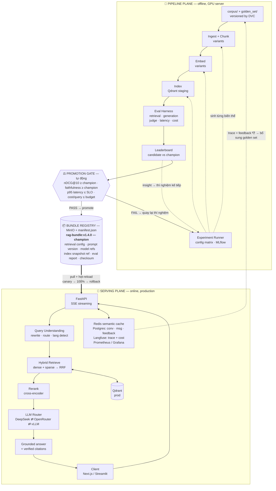

# Phương án nâng cấp toàn diện: RAG Chatbot → Production Document Intelligence Platform

> Ngày: 2026-08-14 · Chủ sở hữu: Le Ba Khanh · Mục tiêu: đạt chuẩn JD Junior/Mid AI Engineer (RAG, LLM) trên thị trường 2026
> Quyết định đã chốt: **LLM hybrid router (DeepSeek/OpenRouter API + vLLM self-host)** · **Docker Compose local + demo HF Spaces** · **Corpus song ngữ Việt–Anh, nguồn công khai** · **4–6 tuần part-time**
> Phần cứng: **RTX 4060 Laptop 8GB VRAM** (local) + **RunPod Secure Cloud, RTX 4090 24GB theo phiên** cho Pipeline Plane. Không có Claude API key.

---

## 1. Đánh giá hiện trạng (brutal honest)

### 1.1 Code thực tế

| Thành phần    | Hiện trạng                                                                                   | Mức độ                 |
| ------------- | -------------------------------------------------------------------------------------------- | ---------------------- |
| Kiến trúc     | 1 file `app.py` 666 dòng, logic UI + model + RAG trộn lẫn                                    | POC                    |
| Ingestion     | `PyPDFLoader` — chỉ text thô, mất bảng/heading/layout                                        | POC                    |
| Chunking      | `EnhancedChunker` hybrid (semantic + fixed) + cache pickle                                   | Điểm sáng duy nhất     |
| Embedding     | `bkai-foundation-models/vietnamese-bi-encoder` — chỉ tiếng Việt, không cross-lingual         | Hạn chế                |
| Vector store  | `Chroma.from_documents()` **in-memory**, mất sạch khi restart                                | POC                    |
| Retrieval     | `as_retriever(k=5)` — dense-only, **không** BM25, **không** rerank, **không** filter         | POC                    |
| Generation    | Vicuna-7B-v1.5 (model 2023, đã lỗi thời), prompt string, parse bằng `text.split("Trả lời:")` | POC                    |
| Citation      | Không có                                                                                     | Thiếu                  |
| State         | `st.session_state` — chat history bay khi refresh browser                                    | POC                    |
| API           | Không có                                                                                     | Thiếu                  |
| Eval          | Không có bất kỳ metric nào                                                                   | **Thiếu nghiêm trọng** |
| Test          | 0 test                                                                                       | Thiếu                  |
| Observability | Không có                                                                                     | Thiếu                  |
| Deploy        | Không Dockerfile, không CI                                                                   | Thiếu                  |

### 1.2 Rủi ro với CV hiện tại (cần xử lý trước khi phỏng vấn)

Mục CV đang ghi cho project này:

> _"...ChromaDB, FAISS, embedding models, chunking strategies (semantic + fixed), **hybrid search**, grounded answer generation, retrieval caching"_
> _"...achieving **3× faster** processing, **15× faster** reprocessing, and an **80–90% cache hit rate** on GPU T4"_

Vấn đề:

1. **"Hybrid search" không tồn tại trong code.** Trong repo, "hybrid" là _hybrid chunking_ (semantic + fixed), không phải _hybrid retrieval_ (BM25 + dense). Interviewer hỏi "anh fuse BM25 và dense bằng RRF hay weighted score?" là lộ ngay. → Sau nâng cấp thì claim này thành **đúng**.
2. **"FAISS" không xuất hiện trong code**, chỉ nằm trong `requirements.txt` như comment `# Alternative vector database`.
3. **Các con số 3×/15×/80–90% không có artifact chứng minh** — không có benchmark script, không có log, không có bảng số. Interviewer kỹ tính sẽ hỏi "đo trên bao nhiêu doc, baseline là gì?". → Sau nâng cấp sẽ có `reports/` với số liệu tái lập được.
4. **Thiếu hoàn toàn từ khóa mà JD RAG 2026 nào cũng có**: reranking, evaluation/RAGAS, observability, citation/grounding, latency SLO.

**Kết luận:** project hiện tại đang ở mức "làm theo tutorial AIO/LangChain". Sau nâng cấp phải trả lời được câu hỏi kinh điển: _"Làm sao anh biết retrieval của anh tốt?"_ — đây chính là ranh giới giữa junior POC và junior production.

---

## 2. Nguyên tắc kiến trúc: tách Pipeline Plane và Serving Plane

Đây là yêu cầu trung tâm của bạn và cũng là **điểm khác biệt lớn nhất** so với mọi RAG project trên GitHub.



<details>
<summary><b>Bản text rút gọn</b> — mở ra nếu preview của bạn không render Mermaid</summary>

```text
PIPELINE PLANE  (offline, GPU server)
  corpus + golden_set (DVC)
    -> Ingest+Chunk (variants) -> Embed (variants) -> Index (Qdrant staging)
    -> Eval Harness (retrieval | generation | judge | latency | cost)
    -> Leaderboard (candidate vs champion)
  Experiment Runner (config matrix, MLflow) dieu khien 3 buoc dau
  Leaderboard --insight--> Experiment Runner

        v
PROMOTION GATE  (tu dong)
  nDCG@10 >= champion   |  faithfulness >= champion
  p95 latency <= SLO    |  cost/query <= budget
  PASS -> promote           FAIL -> quay lai thi nghiem

        v
BUNDLE REGISTRY  (MinIO + manifest.json)
  rag-bundle:v1.4.0 (champion)
  retrieval config | prompt version | model refs
  index snapshot ref | eval report | checksum

        v   pull + hot-reload (canary -> 100% -> rollback)
SERVING PLANE  (online, production)
  Client -> FastAPI (SSE) -> Query Understanding -> Hybrid Retrieve -> Rerank
         -> LLM Router (DeepSeek / OpenRouter / vLLM) -> Grounded answer + citations -> Client
  Hybrid Retrieve <-> Qdrant (prod)
  FastAPI <-> Redis cache | Postgres | Langfuse | Prometheus/Grafana
  Langfuse traces + thumbs-down --> bo sung golden set (quay ve Pipeline Plane)
```

</details>

### 2.1 Hợp đồng giữa hai plane: `RagBundle`

Serving Plane **không bao giờ** import code từ Pipeline Plane. Hai bên chỉ giao tiếp qua một artifact duy nhất, immutable, có version:

```jsonc
// bundles/rag-bundle-v1.4.0/manifest.json
{
  "bundle_version": "1.4.0",
  "created_at": "2026-09-02T10:00:00Z",
  "git_sha": "a1b2c3d",
  "components": {
    "chunking": {
      "strategy": "structure_aware_contextual",
      "target_tokens": 512,
      "overlap_tokens": 64,
    },
    "embedding": {
      "model": "BAAI/bge-m3",
      "dim": 1024,
      "normalize": true,
      "revision": "5617a9f",
    },
    "index": {
      "backend": "qdrant",
      "collection": "docs_v14",
      "snapshot": "s3://bundles/idx_v14.snapshot",
    },
    "retrieval": {
      "mode": "hybrid_rrf",
      "dense_k": 50,
      "sparse_k": 50,
      "rrf_k": 60,
    },
    "rerank": { "model": "BAAI/bge-reranker-v2-m3", "top_n": 6 },
    "prompt": { "id": "grounded_qa_vi_en", "version": 7 },
    "generation": {
      "primary": "deepseek-chat",
      "fallback": "qwen3-8b-vllm",
      "max_tokens": 1024,
      "temperature": 0.0,
    },
  },
  "eval": {
    "golden_set": "golden_v3 (247 queries)",
    "evaluated_with_generator": "deepseek-chat@2026-08", // BẮT BUỘC: gate chỉ so like-for-like
    "judge": {
      "model": "deepseek-reasoner",
      "temperature": 0.0,
      "kappa_vs_human": 0.68,
    },
    "recall@10": 0.913,
    "ndcg@10": 0.847,
    "mrr": 0.791,
    "faithfulness": 0.94,
    "answer_relevancy": 0.89,
    "citation_accuracy": 0.91,
    "refusal_correctness": 0.88,
    "p95_latency_ms": 2840,
    "cost_per_query_usd": 0.0031,
  },
  "gate": {
    "champion_compared": "1.3.2",
    "status": "PASS",
    "report": "reports/eval_v140.html",
  },
  "checksum": "sha256:...",
}
```

Serving đọc manifest → build pipeline runtime. **Đổi config retrieval không cần rebuild Docker image** — chỉ cần `POST /admin/bundle/reload {version}`, có canary + rollback.

### 2.2 Vòng lặp (đúng như bạn mô tả)

```
1. Thí nghiệm   → pipeline/experiments/exp_042_late_chunking.yaml
2. Chạy trên GPU → make eval EXP=exp_042        (MLflow ghi lại toàn bộ)
3. So sánh      → make leaderboard              (bảng vs champion hiện tại)
4. Gate         → make gate BUNDLE=v1.5.0-rc1   (PASS/FAIL tự động)
5. Promote      → make promote                  (đẩy bundle lên registry)
6. Production   → canary 10% traffic → 100% → hoặc rollback 1 lệnh
7. Feedback     → Langfuse trace + user thumbs → bổ sung golden set → quay lại (1)
```

Bước 7 là **Continuous Training loop** — cực kỳ ăn điểm với JD nào có chữ "LLMOps".

---

## 3. Nâng cấp kỹ thuật chi tiết

### 3.1 Ingestion — từ "đọc text" lên "hiểu tài liệu"

| Hiện tại         | Nâng cấp                                                                                                                                                 |
| ---------------- | -------------------------------------------------------------------------------------------------------------------------------------------------------- |
| `PyPDFLoader`    | **Docling** (IBM) hoặc **unstructured**: layout-aware, giữ heading hierarchy, trích bảng ra Markdown, đọc reading-order đúng với PDF 2 cột               |
| Không xử lý scan | **OCR fallback**: phát hiện trang scan (text density < threshold) → Qwen2.5-VL / Gemini Vision (bạn đã có kinh nghiệm từ SmartSchool → tái sử dụng được) |
| Chỉ PDF          | PDF, DOCX, PPTX, XLSX, HTML, Markdown, EML                                                                                                               |
| Đồng bộ, chặn UI | **Async job queue** (arq/Celery): `POST /ingest` trả `job_id`, worker xử lý nền, `GET /ingest/{job_id}` theo dõi tiến độ                                 |
| Không dedupe     | Content-hash dedupe + incremental re-index (chỉ embed lại chunk thay đổi)                                                                                |
| Không metadata   | Metadata phong phú: `doc_id, page, section_path, lang, doc_type, effective_date, tenant_id, table_flag` → dùng cho **metadata filtering** khi retrieve   |

### 3.2 Chunking — giữ điểm mạnh sẵn có, nâng lên state-of-the-art

Giữ `EnhancedChunker` (đó là phần bạn tự viết, có giá trị) nhưng nâng cấp:

1. **Structure-aware chunking**: cắt theo heading hierarchy trước, mới cắt theo token trong từng section. Mỗi chunk mang `section_path = "Chương 2 > Điều 15 > Khoản 3"`.
2. **Contextual Retrieval** (kỹ thuật Anthropic công bố): dùng LLM rẻ sinh 1–2 câu ngữ cảnh cho mỗi chunk (chunk này thuộc phần nào, nói về gì) rồi **prepend vào chunk trước khi embed**. Đây là kỹ thuật giảm retrieval failure rate ~35–49% trong benchmark gốc — và là chủ đề rất "hot" để nói trong phỏng vấn.
3. **Token-based** thay vì character-based (dùng tokenizer của chính embedding model) — `chunk_size=1000 chars` hiện tại là sai chuẩn với model có context 8192 token.
4. **Parent-child (small-to-big)**: embed chunk nhỏ 256 token để retrieve chính xác, nhưng trả về parent 1024 token cho LLM để đủ ngữ cảnh.
5. Cache: thay `pickle` (không an toàn, không portable) bằng **SQLite/Parquet + content-hash**, có TTL và eviction.

> Đây là chỗ để **giữ và làm mạnh hơn** claim "3× faster / 15× reprocess / 80–90% cache hit" — lần này có benchmark script tái lập được.

### 3.3 Embedding & Index

| Hạng mục     | Chọn                                                                                       | Lý do                                                                                                                                                                                    |
| ------------ | ------------------------------------------------------------------------------------------ | ---------------------------------------------------------------------------------------------------------------------------------------------------------------------------------------- |
| Embedding    | **BAAI/bge-m3**                                                                            | Multilingual mạnh với tiếng Việt, 8192 token context, sinh **đồng thời** dense + sparse (lexical) + ColBERT multi-vector → hybrid search "native". Đúng yêu cầu corpus song ngữ Việt–Anh |
| Đối chứng    | `multilingual-e5-large`, `gte-multilingual-base`, giữ `vietnamese-bi-encoder` làm baseline | Có ablation → có bảng số → có nội dung kể trong phỏng vấn                                                                                                                                |
| Vector DB    | **Qdrant**                                                                                 | Hybrid search native, payload filtering, named vectors, scalar/binary quantization, snapshot API (phục vụ bundle), có Docker image nhẹ                                                   |
| Giữ Chroma?  | Bỏ khỏi production, giữ trong pipeline làm baseline so sánh                                | Trung thực với CV                                                                                                                                                                        |
| Quantization | Scalar quantization int8 + HNSW tuning (`m`, `ef_construct`)                               | Ghi điểm phần "inference optimization" bạn đang explore                                                                                                                                  |

### 3.4 Retrieval — nơi tạo khác biệt lớn nhất

Pipeline truy vấn đầy đủ:

```
Query
 ├─ 1. Query Understanding
 │     ├─ Multi-turn rewrite: "cái đó thì sao?" → "chính sách nghỉ phép năm 2026 thì sao?"
 │     ├─ Language detect (vi/en) → cross-lingual expansion
 │     ├─ Routing: NO_RETRIEVAL (chào hỏi) | RETRIEVE | CLARIFY (câu hỏi mơ hồ)
 │     └─ Decomposition: câu hỏi phức → 2–3 sub-query
 ├─ 2. Retrieve (parallel)
 │     ├─ Dense: bge-m3 dense vector, top 50
 │     ├─ Sparse: bge-m3 lexical weights / BM25 (Qdrant sparse), top 50
 │     └─ Metadata filter: tenant_id, doc_type, date range
 ├─ 3. Fusion: Reciprocal Rank Fusion (k=60)
 ├─ 4. Rerank: bge-reranker-v2-m3 cross-encoder → top 6
 ├─ 5. Context assembly: dedupe, parent expansion, token budget, thứ tự theo relevance
 └─ 6. Generate: grounded + citation
```

Bổ sung nên có (tùy thời gian): **HyDE** cho câu hỏi trừu tượng, **semantic cache** (Redis, ngưỡng cosine ~0.95) cắt 30–50% chi phí LLM.

### 3.5 Generation — grounded, có trích dẫn, có guardrail

1. **Structured output bắt buộc**: LLM trả JSON `{answer, citations: [{claim, chunk_id, quote}], confidence, insufficient_context: bool}` — bỏ hẳn `text.split("Trả lời:")`.
2. **Citation verification**: kiểm tra `quote` có thực sự tồn tại trong chunk được cite (string/fuzzy match). Nếu không → đánh dấu unverified, không hiển thị như fact. Đây là chống hallucination ở tầng hệ thống, không phải tầng prompt.
3. **Refusal đúng lúc**: có bộ "unanswerable questions" trong golden set để đo `refusal_correctness`. Rất nhiều RAG demo bịa câu trả lời khi không có context — đo được cái này là điểm cộng lớn.
4. **LLM Router**: DeepSeek API làm primary, OpenRouter (pin slug cụ thể) làm fallback, `qwen3-8b` self-host qua vLLM làm profile tùy chọn khi có GPU rảnh hoặc data nhạy cảm. Có circuit breaker + retry + budget cap. Chi tiết phân vai ở **§3.6**.
5. **Prompt registry**: prompt là file YAML có version, hash, và **được eval như một thành phần** — đổi prompt phải qua gate như đổi model.
6. **Guardrails**:
   - Prompt injection trong **nội dung tài liệu** (attacker upload PDF chứa "ignore previous instructions") — tách rõ ranh giới data/instruction, detect pattern.
   - PII redaction ở tầng log/trace.
   - Rate limit + token budget per tenant.

### 3.6 Phân vai LLM & ngân sách VRAM (ràng buộc phần cứng thật)

Ràng buộc: **RTX 4060 Laptop 8GB**, không có Claude key, chỉ có **DeepSeek API** + **OpenRouter**. vLLM trên Windows chạy qua Docker Desktop + WSL2 GPU passthrough (không có bản native Windows).

#### Ngân sách VRAM 8GB — vì sao không thể self-host generator tại local

| Thành phần           |              VRAM (fp16) | Ghi chú                          |
| -------------------- | -----------------------: | -------------------------------- |
| `bge-m3`             |                  ~2.3 GB | thường trực trong Serving Plane  |
| `bge-reranker-v2-m3` |                  ~2.2 GB | thường trực                      |
| **Còn lại**          |              **~3.5 GB** | sau khi trừ overhead CUDA/driver |
| Qwen3-8B AWQ 4-bit   | ~5 GB weights + KV cache | **không vừa**                    |

Context RAG thực tế (6 chunk × ~1000 token + prompt + output) cần KV cache đáng kể. Kết luận: **8GB đủ cho embedding + reranker, không đủ để thêm generator.** Đây là lý do kỹ thuật, không phải lựa chọn tùy tiện.

#### Bảng phân vai

| Vai                                   | Chạy ở đâu                                            | Model                                              | Vì sao                                                                                              |
| ------------------------------------- | ----------------------------------------------------- | -------------------------------------------------- | --------------------------------------------------------------------------------------------------- |
| Embedding                             | **Local GPU**                                         | `bge-m3`                                           | Không cần API. Quyết định phần lớn metric                                                           |
| Reranker                              | **Local GPU**                                         | `bge-reranker-v2-m3`                               | Như trên                                                                                            |
| **Generator được đo** (pipeline eval) | **vLLM, GPU thuê**                                    | `Qwen3-8B` pinned revision, `temp=0`, seed cố định | **Tái lập tuyệt đối** — số dịch chuyển thì chắc chắn do retrieval, không do provider đổi model ngầm |
| Contextual chunking (5–10k call)      | **vLLM offline batch, GPU thuê**                      | `Qwen3-8B`                                         | Rẻ nhất, không rate limit, không phụ thuộc mạng                                                     |
| Golden set draft generation           | DeepSeek API                                          | `deepseek-chat`                                    | Chạy 1 lần, rẻ                                                                                      |
| Generator production (serving)        | **DeepSeek API** → OpenRouter fallback → vLLM profile | `deepseek-chat`                                    | Always-on, không cần GPU → giữ được demo public (`G6`)                                              |
| Query rewrite (online)                | DeepSeek API                                          | `deepseek-chat`                                    | Latency thấp, không chịu được cold start của vLLM                                                   |
| **Judge**                             | **DeepSeek trực tiếp**                                | `deepseek-reasoner`, `temp=0`, pinned              | Judge là **dụng cụ đo** — phải là model mạnh nhất có sẵn                                            |
| Judge cross-check (50 mẫu)            | OpenRouter, **pin slug khác họ**                      | không dùng preset                                  | Đo agreement giữa 2 họ model → phát hiện bias của judge chính                                       |

#### Ba quy tắc bắt buộc về tính tái lập

1. **Không bao giờ dùng `@preset/my-luna-pro` (hay bất kỳ OpenRouter preset nào) trong eval.** Preset là config phía server, có thể đổi model/params bất cứ lúc nào → metric dịch chuyển mà không truy được nguyên nhân. Preset chỉ dùng cho demo tương tác. Trong eval **luôn pin slug model tường minh**.
2. **Ghi lại model thực sự phục vụ request.** OpenRouter trả field `model` trong response — log nó vào eval record. Nếu khác với slug đã pin → cảnh báo drift.
3. **`temperature=0` + seed cố định cho mọi lần chạy eval.** Ghi `evaluated_with_generator` vào `RagBundle`; gate **chỉ so like-for-like** giữa các bundle cùng generator.

#### Rủi ro validity phải xử lý

Nếu pipeline eval dùng Qwen3-8B (vLLM) mà production serve DeepSeek → **gate đang gác một hệ thống khác với hệ thống thật**. Xử lý:

- Tách rõ **2 tầng eval**:
  - **Retrieval eval** (Recall@k, nDCG, MRR, P@k) — **không cần LLM nào**, chỉ cần embedding + reranker chạy local. Deterministic, rẻ, chạy trong CI mỗi commit. _Đây là phần lõi và hoàn toàn không bị ảnh hưởng bởi việc thiếu Claude key._
  - **End-to-end eval** (faithfulness, citation accuracy, refusal) — cần generator, chạy nightly, ghi rõ generator nào.
- Thêm **generator ablation** vào ma trận: `Qwen3-8B (vLLM)` vs `deepseek-chat` vs `OpenRouter pinned slug` trên **cùng một retrieval stack** → bảng quality × latency × cost. Bảng này biến ràng buộc phần cứng thành một **quyết định model routing có số liệu** — đúng thứ JD ghi "model selection / cost governance" muốn nghe.
- Trong so sánh head-to-head giữa các generator, ưu tiên **metric xác định** (citation accuracy, refusal correctness — kiểm bằng rule, không qua judge) để tránh self-preference bias khi judge cùng họ với một trong các generator. Faithfulness vẫn báo cáo nhưng **ghi rõ cảnh báo bias**.

#### Kế hoạch dùng RunPod & nguyên tắc không mang secret lên máy thuê

**Chỉ 3 task bắt buộc cần GPU lớn hơn 4060.** Tổng cả dự án ước ~10–20 GPU-hour.

| Task                                      | Vì sao cần                                                       | VRAM tối thiểu | Ước lượng thô |
| ----------------------------------------- | ---------------------------------------------------------------- | -------------- | ------------- |
| `W3-04` Contextual chunking               | ~15k chunk, prompt chứa cả tài liệu → KV cache lớn, 8GB không đủ | 24 GB          | 2–4h          |
| `W5-11` Generator ablation, nhánh vLLM    | Serve `Qwen3-8B` cho 250 query e2e                               | 24 GB          | 1–2h          |
| _(tùy chọn)_ Fine-tune reranker/embedding | `bge-reranker-v2-m3` chỉ ~568M tham số → 24GB thừa sức           | 24 GB          | 3–6h          |
| `W2-08`, `W3-09` Ablation index           | **Không bắt buộc** — 4060 chạy qua đêm là xong                   | —              | —             |

##### Chọn cấu hình RunPod

**Secure Cloud vs Community Cloud** — đây là quyết định quan trọng nhất, và là lý do RunPod tốt hơn vast.ai:

|                 | Secure Cloud                             | Community Cloud                               |
| --------------- | ---------------------------------------- | --------------------------------------------- |
| Chủ máy         | Đối tác datacenter được RunPod thẩm định | Cá nhân / host nhỏ ngang mô hình vast.ai      |
| Mô hình tin cậy | Có kiểm soát vận hành & vật lý           | Chủ máy có root — coi như đã bị xâm nhập      |
| Giá             | Cao hơn                                  | Rẻ hơn                                        |
| **Khuyến nghị** | ✅ **Dùng mặc định**                     | Chỉ cho job throwaway, không dữ liệu nhạy cảm |

Chênh lệch giá trên tổng ~15 GPU-hour là rất nhỏ so với việc mất kiểm soát dữ liệu. **Chốt: Secure Cloud.**

**GPU nên chọn:**

| GPU          |  VRAM | Dùng cho                                                    | Đánh giá                                               |
| ------------ | ----: | ----------------------------------------------------------- | ------------------------------------------------------ |
| **RTX 4090** | 24 GB | Contextual chunking, generator ablation, fine-tune reranker | ✅ **Mặc định** — throughput/giá tốt nhất cho model 8B |
| L4           | 24 GB | Như trên nhưng chậm hơn                                     | Rẻ hơn; hợp job dài chạy qua đêm, không gấp            |
| RTX A5000    | 24 GB | Index build, embedding ablation                             | Rẻ, đủ cho job không cần throughput cao                |
| L40S / A40   | 48 GB | Chỉ khi muốn thêm `Qwen3-14B/32B` vào generator ablation    | Mở rộng scope, không bắt buộc                          |
| A100 / H100  | 80 GB | Không cần cho scope này                                     | Lãng phí tiền                                          |

**Pod vs Serverless:** dùng **Pod (On-Demand)** cho tất cả. Serverless hợp với endpoint always-on chịu tải thất thường — không phải mô hình của ta (job batch 2–4h). Cold start của Serverless với model 8B còn làm chậm eval.

**Spot vs On-Demand:** Spot rẻ hơn nhưng có thể bị thu hồi. **Chỉ dùng Spot khi job đã resumable.** Vì `W3-04` và `W2-07` đều có yêu cầu "resume được khi crash giữa đường" trong DoD, sau khi hoàn thành 2 task đó thì Spot trở thành lựa chọn an toàn → tiết kiệm thêm.

**Network Volume — bắt buộc dùng.** Trọng số cần tải mỗi phiên: `bge-m3` (~2.3GB) + `bge-reranker-v2-m3` (~2.2GB) + `Qwen3-8B` (~16GB fp16 / ~5GB AWQ). Không có volume thì **mỗi lần khởi động pod đều trả tiền GPU trong lúc ngồi chờ download**. Gắn network volume ở `/workspace`, cache HF vào đó (`HF_HOME=/workspace/.hf`) → tải một lần dùng mãi. Lưu ý: volume gắn với một datacenter cụ thể, nên chọn region và giữ nguyên.

**Ước lượng chi phí:** ~15 GPU-hour trên card 24GB Secure Cloud → bậc độ lớn **vài chục USD trở xuống** cho cả dự án. Giá RunPod thay đổi theo thời điểm — kiểm tra bảng giá niêm yết trước khi thuê, đừng tin con số này như cam kết.

##### Nguyên tắc secret (giữ nguyên, không nới lỏng)

**Nguyên tắc kiến trúc:** _máy GPU thuê chỉ chạy job GPU-bound, tự chứa; mọi thứ chạm tới API trả phí đều chạy ở máy local._

Hệ quả: **không job nào ở trên cần API key.** Contextual chunking dùng vLLM chạy ngay trên pod. Generator ablation tách nhánh theo nơi chạy — nhánh vLLM trên pod, nhánh DeepSeek/OpenRouter chạy từ laptop (chúng không cần GPU). Judge luôn chạy từ laptop.

Secure Cloud có mức tin cậy cao hơn hẳn Community Cloud / vast.ai, nhưng **trust boundary vẫn bao gồm RunPod và đối tác datacenter** — bạn đang chạy container trên hạ tầng của người khác, không phải VPC của mình. Giữ nguyên quy tắc vì nó **không tốn gì**: các job vốn dĩ không cần key.

Quy tắc vận hành trên RunPod:

1. **SSH bằng keypair riêng cho RunPod**, không dùng chung key với GitHub/máy cá nhân. Thu hồi khi xong dự án.
2. **Không đặt `DEEPSEEK_API_KEY` / `OPENROUTER_API_KEY` vào pod env vars hay RunPod Secrets** — không ngoại lệ.
3. **Chuyển dữ liệu:** HF private dataset repo + fine-grained token scoped đúng repo đó (thu hồi sau job), hoặc `runpodctl send/receive`. Không cấu hình git credential trên pod — kéo code từ repo public hoặc upload tarball.
4. **Không lưu gì nhạy cảm trên network volume** — volume do RunPod quản lý, không mã hóa đầu-cuối phía bạn. _(Với corpus công khai như quyết định bên dưới thì điểm này thành vô hại — đó là một lợi ích phụ của việc chọn dữ liệu public.)_
5. Terminate pod khi xong; giữ lại network volume nếu còn phiên sau.

#### Corpus: bắt buộc dùng dữ liệu công khai

Project này sẽ nằm trên **GitHub public** + **HF Spaces demo public**, và một phần chạy trên **máy thuê của bên thứ ba**. Cả ba đều là công bố dữ liệu ra ngoài.

⚠️ **Không dùng tài liệu thật của khách hàng Enigmas** — rủi ro NDA nghiêm trọng hơn nhiều so với rủi ro lộ API key.

Nguồn song ngữ VI–EN công khai phù hợp: báo cáo World Bank / ADB về Việt Nam (song song VI–EN), văn bản pháp luật VN có bản dịch chính thức, báo cáo thường niên doanh nghiệp niêm yết HOSE (nhiều bên phát hành cả hai ngôn ngữ). Chất lượng eval không kém, mà được tự do public toàn bộ — vốn là mục tiêu chính.

### 3.7 Serving Plane

```
serving/
├── api/
│   ├── routes/  chat.py (SSE stream) · ingest.py · documents.py · feedback.py · admin.py · health.py
│   ├── deps.py            # DI: bundle, qdrant, redis, db
│   └── middleware/        # auth (API key/JWT), rate limit, request-id, structured log
├── core/
│   ├── bundle_loader.py   # tải & hot-reload RagBundle từ registry
│   ├── retriever.py       # đọc config từ bundle, không hardcode
│   ├── generator.py       # LLM router + streaming + citation parse
│   └── cache.py           # semantic cache
├── db/                    # SQLAlchemy + Alembic: conversation, message, document, job, feedback
└── workers/               # arq worker cho ingestion
```

Bổ sung:

- **Conversation persistence trong Postgres** thay `st.session_state` — chat history sống sót qua restart, hỗ trợ multi-user.
- **SSE streaming** thay `invoke()` chặn — UX khác hẳn.
- **Multi-tenant isolation** ở tầng Qdrant payload filter + Postgres row-level.
- **Health/readiness probe** phân biệt rõ (liveness ≠ model loaded).

### 3.8 Observability

| Lớp      | Công cụ                                   | Đo gì                                                                                                                 |
| -------- | ----------------------------------------- | --------------------------------------------------------------------------------------------------------------------- |
| Trace    | **Langfuse** (self-host trong compose)    | Full trace mỗi query: rewrite → chunks retrieved (kèm score) → rerank → prompt → completion. Cost & token per step    |
| Metrics  | Prometheus + Grafana                      | RED (rate/error/duration), p50/p95/p99 theo từng stage, cache hit rate, retrieval empty rate, refusal rate, cost/hour |
| Log      | structlog JSON + request_id correlation   | Debug được 1 request xuyên toàn hệ thống                                                                              |
| Feedback | 👍/👎 + lý do → Postgres → Langfuse score | Câu 👎 tự động vào hàng đợi review → bổ sung golden set                                                               |

**Dashboard Grafana "RAG Health"** với: retrieval quality proxy (avg top-1 rerank score), % câu trả lời có citation verified, cost/day, p95 latency. Screenshot dashboard này đưa vào README = ấn tượng ngay từ giây đầu.

---

## 4. Eval Harness — trái tim của Pipeline Plane

Đây là phần **quyết định** việc project được đánh giá là junior hay mid.

### 4.1 Golden dataset (versioned bằng DVC)

- **200–300 query** song ngữ Việt–Anh trên corpus công khai (xem §3.6), chia nhóm:
  - `factoid` (tra cứu 1 điểm), `multi_hop` (cần ≥2 chunk), `aggregation` (tổng hợp/so sánh), `table_lookup`, `cross_lingual` (hỏi tiếng Việt – tài liệu tiếng Anh và ngược lại), `unanswerable` (kiểm tra refusal), `adversarial` (prompt injection).
- Mỗi mục: `query, relevant_chunk_ids[], reference_answer, difficulty, category, lang`.
- Quy trình tạo: LLM sinh nháp từ chunk → **human review bắt buộc** (bạn tự review) → freeze thành `golden_v1`. Ghi rõ quy trình vào README — interviewer rất thích nghe về data curation.

### 4.2 Bộ metric

**Retrieval (không cần LLM, rẻ, chạy mỗi commit):**
`Recall@{1,5,10,20}` · `Precision@k` · `MRR` · `nDCG@10` · `Hit Rate` · breakdown theo category & language

**Generation (LLM-as-judge, chạy nightly):**
`Faithfulness` (mọi claim có support trong context?) · `Answer Relevancy` · `Context Precision/Recall` (RAGAS) · `Citation Accuracy` (quote verify được) · `Refusal Correctness` · `Answer Similarity` vs reference

**Vận hành:**
`p50/p95 latency` theo stage · `cost/query` · `tokens/query` · `cache hit rate`

**Judge = `deepseek-reasoner`, `temperature=0`, pinned model** (không dùng OpenRouter preset — xem §3.6). Judge là dụng cụ đo, phải là model mạnh nhất có sẵn.

**Judge calibration (điểm cộng hiếm gặp):** tự gán nhãn thủ công 50 mẫu, đo Cohen's kappa giữa LLM judge và bạn. Báo cáo con số agreement → chứng minh bạn hiểu judge cũng có thể sai. Rất ít candidate junior làm việc này.

**Self-preference bias — phải nói rõ trong report:** khi so `deepseek-chat` với `qwen3-8b` mà judge cũng là DeepSeek, judge có xu hướng ưu ái output cùng họ. Cách xử lý: (a) head-to-head giữa các generator ưu tiên **metric xác định** (citation accuracy, refusal correctness — kiểm bằng rule, không qua judge); (b) cross-check 50 mẫu bằng một model **khác họ** qua OpenRouter (pin slug tường minh), báo cáo agreement giữa 2 judge; (c) faithfulness vẫn báo cáo nhưng kèm cảnh báo bias.

### 4.3 Experiment runner + ablation

```yaml
# pipeline/experiments/exp_042_matrix.yaml
name: chunking_x_embedding_ablation
grid:
  chunking:
    [
      fixed_512,
      semantic,
      hybrid_current,
      structure_aware,
      structure_aware_contextual,
    ]
  embedding: [vietnamese-bi-encoder, multilingual-e5-large, bge-m3]
  retrieval: [dense_only, hybrid_rrf]
  rerank: [none, bge-reranker-v2-m3]
  generator: [qwen3-8b-vllm, deepseek-chat] # chi dung cho e2e eval; retrieval eval khong can
golden_set: golden_v1
seed: 1337
temperature: 0.0
track: mlflow
```

→ `make eval EXP=exp_042` chạy toàn bộ tổ hợp trên GPU server, log MLflow, xuất bảng leaderboard + biểu đồ. **Đây chính là "3× faster" phiên bản có bằng chứng.**

### 4.4 Regression gate

```python
GATE = {
    "ndcg@10": {"min_delta": -0.01},  # không được tụt quá 1%
    "faithfulness": {"min_delta": 0.00},  # không được tụt
    "citation_accuracy": {"min_absolute": 0.85},
    "p95_latency_ms": {"max_absolute": 3500},
    "cost_per_query_usd": {"max_absolute": 0.005},
}
```

`make gate` → PASS/FAIL + HTML report. CI chặn merge nếu FAIL. Đây là câu trả lời hoàn hảo cho _"Làm sao anh biết thay đổi này không làm hệ thống tệ đi?"_

---

## 5. Cấu trúc repo đề xuất

```
rag-platform/
├── README.md                  # có kiến trúc, bảng metric thật, GIF demo, quickstart 1 lệnh
├── Makefile                   # up, eval, gate, promote, bench, test
├── docker-compose.yml         # api, worker, qdrant, postgres, redis, langfuse, prometheus, grafana
├── docker-compose.gpu.yml     # + vllm, overlay cho GPU server
│
├── packages/
│   └── rag_core/              # THƯ VIỆN DÙNG CHUNG (điểm mấu chốt của kiến trúc 2 plane)
│       ├── ingest/            # loaders, ocr, normalizer
│       ├── chunking/          # fixed, semantic, structure_aware, contextual  (từ enhanced_chunking.py)
│       ├── embedding/         # provider abstraction
│       ├── retrieval/         # dense, sparse, rrf, rerank, query_transform
│       ├── generation/        # llm router, prompts, citation, guardrails
│       ├── bundle/            # RagBundle schema, load/save/validate
│       └── schemas/           # pydantic models — hợp đồng dữ liệu
│
├── pipeline/                  # ═══ PIPELINE PLANE (chạy trên GPU server) ═══
│   ├── experiments/           # *.yaml config matrix
│   ├── datasets/              # golden set (DVC), corpus manifest
│   ├── eval/                  # retrieval_eval.py, generation_eval.py, judge.py, gate.py
│   ├── indexing/              # build_index.py, snapshot.py
│   ├── finetune/              # (tuần 5–6) fine-tune reranker/embedding trên domain
│   └── reports/               # HTML/MD reports, leaderboard
│
├── serving/                   # ═══ SERVING PLANE (production) ═══
│   ├── api/ core/ db/ workers/
│   └── Dockerfile
│
├── apps/
│   ├── web/                   # Next.js hoặc Streamlit v2 (streaming + citation UI + feedback)
│   └── hf_space/              # bản rút gọn deploy HF Spaces (dùng API model, không GPU)
│
├── infra/                     # grafana dashboards, prometheus rules, alembic
├── tests/                     # unit, integration, eval smoke
└── .github/workflows/         # ci.yml, nightly-eval.yml, release.yml
```

**Quy tắc bất khả xâm phạm:**

- `serving/` **không** import `pipeline/`. Cả hai chỉ import `packages/rag_core`.
- `serving/` **không** chứa hằng số config retrieval — mọi thứ đến từ `RagBundle`.
- Mọi thay đổi ảnh hưởng chất lượng → phải đi qua `pipeline/eval` → `gate` → `promote`.

---

## 6. Lộ trình 6 tuần (part-time ~12–15h/tuần)

| Tuần  | Mục tiêu                               | Deliverable kiểm chứng được                                                                                                                                                          |
| ----- | -------------------------------------- | ------------------------------------------------------------------------------------------------------------------------------------------------------------------------------------ |
| **1** | **Nền móng + Eval trước tiên**         | Monorepo, `rag_core` refactor từ code cũ, docker-compose (qdrant/postgres/redis), **golden set v1 (150 query)**, retrieval eval chạy được, **baseline number của hệ thống hiện tại** |
| **2** | **Retrieval upgrade**                  | bge-m3, hybrid RRF, reranker, metadata filter. Ablation matrix đầu tiên → leaderboard. Kỳ vọng nDCG@10 tăng rõ rệt so với baseline                                                   |
| **3** | **Ingestion + Chunking nâng cao**      | Docling, structure-aware + contextual chunking, parent-child, async ingestion worker, incremental re-index                                                                           |
| **4** | **Serving Plane**                      | FastAPI + SSE streaming + citation + LLM router + Postgres persistence + auth + semantic cache. Bundle loader + hot-reload                                                           |
| **5** | **Eval đầy đủ + Gate + Observability** | RAGAS/judge metrics, judge calibration, `make gate`, Langfuse + Grafana dashboard, CI (lint/test/smoke-eval) + nightly full eval                                                     |
| **6** | **Hoàn thiện & trình bày**             | Web UI streaming + citation highlight + feedback, HF Spaces demo, README có số liệu thật, ARCHITECTURE.md + EVALUATION.md, load test (locust), cập nhật CV                           |

**Cần RunPod ở tuần nào:** chỉ **tuần 3** (`W3-04` contextual chunking) và **tuần 5** (`W5-11` generator ablation). Tuần 1, 2, 4, 6 chạy trọn trên 4060 local.

**Nguyên tắc thứ tự:** Tuần 1 làm eval **trước** khi tối ưu bất cứ thứ gì. Không có baseline thì mọi cải tiến sau đó đều là cảm tính — và đó chính là lỗi của phiên bản hiện tại.

**Nếu chỉ có 2 tuần (bản rút gọn):** Tuần 1 = golden set + retrieval eval + baseline; Tuần 2 = hybrid + rerank + FastAPI + citation + Docker + README có bảng số. Bỏ Langfuse/Grafana/CT loop.

---

## 7. Mapping sang JD thị trường

| Yêu cầu thường gặp trong JD RAG/LLM 2026 | Sau nâng cấp, chứng minh bằng                                                                       |
| ---------------------------------------- | --------------------------------------------------------------------------------------------------- |
| Xây dựng RAG pipeline end-to-end         | `packages/rag_core` + 2 plane rõ ràng                                                               |
| Hybrid search, reranking                 | Qdrant sparse+dense, RRF, bge-reranker + **bảng số ablation**                                       |
| Vector database (Qdrant/Milvus/pgvector) | Qdrant với quantization, snapshot, payload filter                                                   |
| Chunking strategies                      | 5 chiến lược có so sánh định lượng, kể cả Contextual Retrieval                                      |
| Đánh giá chất lượng RAG                  | Golden set + RAGAS + LLM judge **có calibration** + regression gate                                 |
| Prompt engineering                       | Prompt registry có version, được eval như một component                                             |
| LLM API + self-host                      | Router DeepSeek ⇄ OpenRouter ⇄ vLLM, circuit breaker, budget cap; **generator ablation có số liệu** |
| FastAPI, streaming, async                | SSE, async worker, connection pooling                                                               |
| Docker, CI/CD                            | Compose 1 lệnh, GitHub Actions, nightly eval                                                        |
| Observability, cost control              | Langfuse + Prometheus/Grafana + cost/query dashboard                                                |
| Guardrails, an toàn                      | Prompt injection defense, citation verification, PII redaction                                      |
| MLOps / CT loop                          | Bundle registry + promotion gate + feedback → golden set                                            |
| Multi-tenant                             | Payload filter + row-level isolation                                                                |

Sau khi hoàn thành, project này **một mình** phủ gần trọn một JD Mid-level RAG Engineer, không chỉ Junior.

---

## 8. Mục CV sau nâng cấp (bản nháp)

```latex
\textbf{RAG Platform -- Production Document Intelligence (Pipeline/Serving Split)}
\begin{highlights}
  \item Architected a two-plane RAG system separating an offline evaluation pipeline
        (GPU) from an online serving plane, connected by versioned, signed
        \textbf{RagBundle} artifacts with an automated regression gate --
        retrieval configs ship to production without rebuilding or redeploying services.
  \item Built a hybrid retrieval stack (BGE-M3 dense + sparse, RRF fusion,
        cross-encoder reranking, metadata filtering) on Qdrant, lifting nDCG@10 from
        X to Y (+Z\%) over the dense-only baseline on a 250-query bilingual VI--EN golden set.
  \item Implemented structure-aware + contextual chunking (LLM-generated chunk context)
        with content-hash caching; N\% fewer retrieval failures and M x faster reprocessing.
  \item Shipped an evaluation harness -- Recall@k / MRR / nDCG, RAGAS faithfulness,
        citation accuracy, refusal correctness -- with LLM-judge calibration
        (Cohen's kappa = K vs human labels) gating every merge in CI.
  \item Productionized FastAPI with SSE streaming, verified citations, prompt-injection
        guardrails, semantic caching, and a provider-routing layer (DeepSeek API,
        OpenRouter, self-hosted vLLM) with circuit breakers and budget caps;
        Langfuse tracing + Grafana give p95 latency and cost-per-query SLOs.
  \item Ran a generator ablation -- self-hosted Qwen3-8B (vLLM, pinned weights, greedy
        decoding) vs hosted APIs on an identical retrieval stack -- selecting the
        production model on measured quality/latency/cost rather than vendor default;
        each bundle records the generator it was evaluated with, so the regression gate
        only ever compares like-for-like.
  \item \textbf{Stack:} Python, FastAPI, Qdrant, PostgreSQL, Redis, vLLM, DeepSeek API,
        OpenRouter, BGE-M3, Docling, MLflow, DVC, Langfuse, Prometheus/Grafana, Docker,
        GitHub Actions.
\end{highlights}
```

> ~~Mọi chỗ `X/Y/Z/N/M/K` sẽ được điền bằng **số thật** từ `pipeline/reports/`, có script tái lập.~~
>
> ⚠️ **Bản nháp trên đã hết hiệu lực (07/09/2026, `W6-07`+`W6-08`).** Điền số
> thật vào nó là không đủ: **năm dòng của nó mô tả một hệ thống khác hệ thống đã
> xây** — "signed" (thật ra là checksum sha256), ablation "Qwen3-8B qua vLLM"
> (thật ra là DeepSeek vs GLM, hai API hosted), "OpenRouter" (không có khoá,
> chưa từng phục vụ request nào), "RAGAS" (cố ý **không** dùng — xem
> `pipeline/eval/generation_metrics.py` §1), và "250-query" (thật ra 242).
> Bản CV cuối, kèm bảng lệnh tái lập cho từng con số:
> **[`reports/tasks/w6-07-08-cv.md`](reports/tasks/w6-07-08-cv.md)**.

---

## 9. Rủi ro & cách kiểm soát

| Rủi ro                                                                     | Xác suất                  | Giảm thiểu                                                                                                                                                                           |
| -------------------------------------------------------------------------- | ------------------------- | ------------------------------------------------------------------------------------------------------------------------------------------------------------------------------------ |
| Scope creep, làm 3 tháng không xong                                        | Cao                       | Tuần 1 phải có eval chạy được. Mỗi tuần 1 deliverable demo được. Cắt tính năng, không cắt eval                                                                                       |
| Chi phí LLM judge cho eval                                                 | Thấp                      | DeepSeek rất rẻ so với frontier model; cache judge theo hash (query+answer+context), smoke set 30 câu cho CI, full set chỉ nightly                                                   |
| OpenRouter preset đổi model ngầm → metric dịch không rõ nguyên nhân        | **Cao**                   | Cấm dùng preset trong eval; luôn pin slug; log field `model` thực tế trong response và cảnh báo khi lệch                                                                             |
| Eval bằng Qwen3-8B nhưng production serve DeepSeek → gate gác sai hệ thống | **Cao**                   | `RagBundle.evaluated_with_generator` bắt buộc; gate chỉ so like-for-like; chạy generator ablation định kỳ                                                                            |
| 8GB VRAM không đủ cho embedding + reranker + LLM cùng lúc                  | Cao                       | Serving chỉ giữ embedding + reranker trên GPU (~4.5GB); generator qua API. vLLM chỉ bật theo phiên trên GPU thuê                                                                     |
| Golden set tốn công thủ công                                               | Cao                       | LLM sinh nháp → chỉ review/sửa. 150 câu ≈ 6–8h. Đây là khoản đầu tư đáng giá nhất trong project                                                                                      |
| Không có GPU thường trực                                                   | Trung bình                | Pipeline plane chạy theo phiên trên RunPod Secure Cloud (RTX 4090 24GB) + network volume. Serving plane không cần GPU (dùng API)                                                     |
| Lộ API key / dữ liệu trên GPU thuê                                         | Trung bình (Secure Cloud) | Pod chỉ chạy job GPU-bound tự chứa, **không mang API key**. Chuyển dữ liệu bằng token scoped ngắn hạn, thu hồi sau job. SSH keypair riêng cho RunPod. **Không dùng Community Cloud** |
| Dùng tài liệu thật của khách hàng Enigmas → vi phạm NDA                    | **Cao, hậu quả nặng**     | Bắt buộc corpus công khai (World Bank/ADB VN, văn bản pháp luật có bản dịch chính thức, báo cáo thường niên HOSE). Kiểm tra ở `W0-03` trước khi ingest bất cứ file nào               |
| Quên terminate pod / network volume tính tiền âm thầm                      | Trung bình                | Đặt spending limit trên RunPod; checklist cuối mỗi phiên phải terminate pod; ghi GPU-hour đã dùng vào `reports/tasks/gpu-usage.md`                                                   |
| Over-engineering, khó demo                                                 | Trung bình                | `make up` phải chạy được toàn bộ trên laptop. HF Spaces demo là bắt buộc                                                                                                             |
| Repo cũ đang được link trong CV                                            | —                         | Nâng cấp **trên repo mới**, giữ repo cũ tới khi bản mới có README + demo hoàn chỉnh, rồi mới đổi link                                                                                |

---

## 10. Bước kế tiếp

> **Tracking:** toàn bộ task, trạng thái và gate được kiểm soát tại [`CHECKLIST.md`](CHECKLIST.md) — 71 task, 6 gate. File đó là nguồn sự thật về tiến độ; tài liệu này chỉ giữ phần thiết kế.

Đề xuất bắt đầu ngay bằng **Tuần 1**, theo thứ tự:

1. Khởi tạo monorepo + `packages/rag_core`, port `enhanced_chunking.py` vào `rag_core/chunking/`.
2. `docker-compose.yml` với Qdrant + Postgres + Redis.
3. Chọn & thu thập corpus song ngữ **công khai** (~50–100 tài liệu) — xem ràng buộc NDA ở §3.6.
4. Script sinh golden set + review thủ công → `golden_v1`.
5. `pipeline/eval/retrieval_eval.py` → **đo baseline của hệ thống hiện tại** và ghi vào `reports/runs/baseline-retrieval.md`.

Con số baseline ở bước 5 là mốc tham chiếu cho toàn bộ 5 tuần còn lại.
