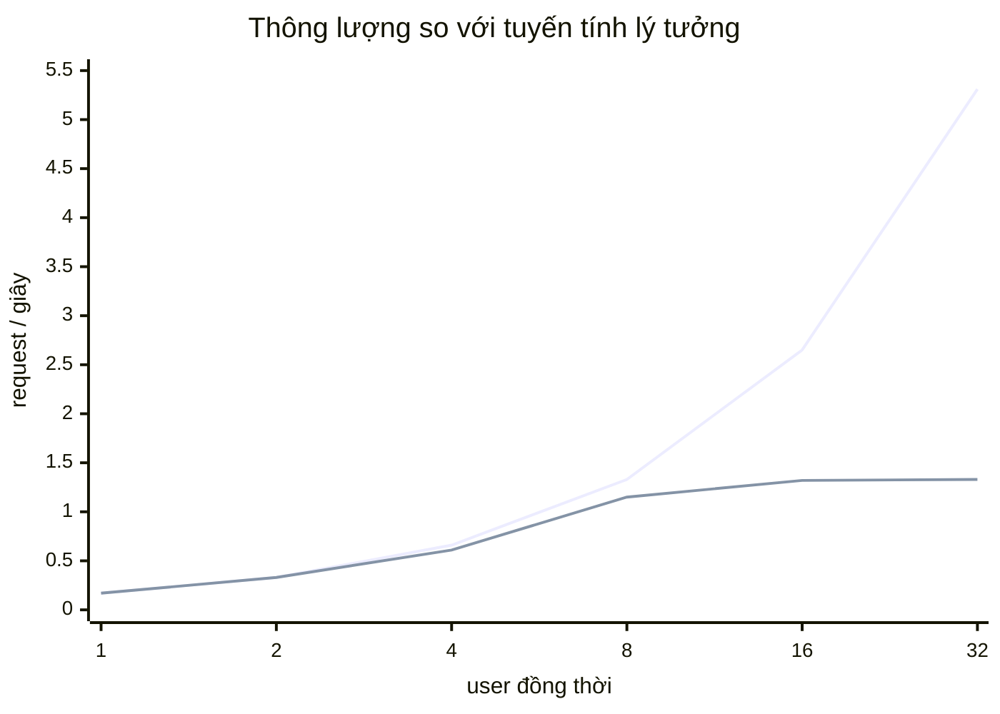
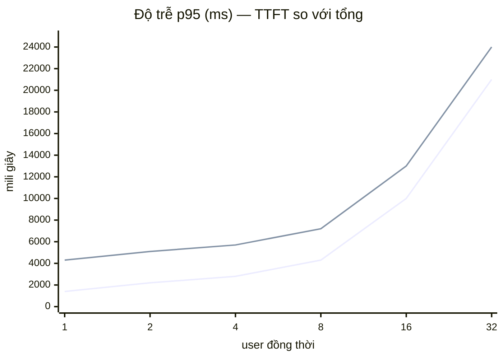

# `W6-05` — Load test: trần thông lượng là **1,33 req/s**, và nó nằm ở rerank

> Ngày 06/09/2026 · chi phí **$0** (không lời gọi API trả tiền nào) ·
> `plans/reports/runs/w605-sweep-deepseek.json` ·
> `plans/reports/probes/w605-au11-singleflight.json` ·
> `plans/reports/probes/w605-td72-coldstart.json` (+ `-fixed`)

DoD: `reports/tasks/loadtest.md` có biểu đồ + điểm bão hoà. Nợ mang theo:
`AU-11`, `AU-14`…`AU-17`, `TD-63`, `TD-72`, `TD-75`, `TD-76`, và đòn bẩy p95 còn
lại sau `W5-11` là `DEFAULT_RERANK_CANDIDATES`.

---

## 0. Ba câu trả lời

1. **Trần thông lượng của một instance: 1,33 req/s (~80 req/phút).** Nó bằng
   **91%** của `1 / thời-gian-rerank-một-lượt` — tức trần này *là* `TD-63`,
   không phải một hệ quả xa xôi của nó.
2. **`AU-11` đúng như mô tả, đo được**: 8 câu hỏi **giống hệt nhau** gửi đồng
   thời ⇒ **8** lời gọi nhà cung cấp. Cùng câu hỏi ấy gửi *nối đuôi* ⇒ **0** lời
   gọi, 50 ms. Cache không hỏng; thứ thiếu là single-flight.
3. **`TD-72` đã vá và đo lại**: request đầu sau khi tiến trình lên **13.386 ms →
   4.427 ms**, TTFT **10.469 ms → 1.507 ms**. Giá phải trả: khởi động dài thêm
   8,4 giây.

---

## 1. ⭐⭐ Một load test gọi DeepSeek thật là một load test đo DeepSeek

`W5-11` đo: p95 end-to-end 4.842 ms, trong đó phần của chúng ta (`prepare` =
embed + truy hồi + rerank) là **787 ms — 16%**. 84% còn lại là thời gian nhà
cung cấp sinh token: nằm sau hàng đợi của một bên thứ ba, thay đổi theo giờ
trong ngày, và **không phải thứ đường cong bão hoà nói về**.

Ba hệ quả, cả ba đều đủ để một mình quyết định:

* Số hạng trội của phép đo sẽ là tải hiện tại của DeepSeek, không phải trần của
  stack này.
* Phép đo càng đáng tin (càng nhiều mẫu) thì càng đắt — một quét 6 bậc × 60 giây
  là ~400 request.
* Và `AU-11` biến mỗi lượt trùng câu hỏi thành một lần trả tiền nữa, nên đúng
  cái đang định đo lại là cái làm hoá đơn phồng lên.

Nên `loadtest/stub_llm.py` thay **đúng một thứ**: lời gọi HTTP tới nhà cung cấp.
Truy hồi thật, rerank thật (kể cả khoá GPU), Qdrant thật, Postgres thật, Redis
thật, xác minh trích dẫn thật. Token là giả — nhưng giả theo phân phối **đo được
từ 242 request thật của `W5-11`**: 600 ms tới token đầu, rồi 6,5 ms/token, 185
token (p50 thật). Chi phí lượt này: **$0**.

**Phép kiểm hiệu chỉnh**: u=1 với stub cho total p95 **4.300 ms**; DeepSeek thật
cho **4.842 ms**. Stub nhanh hơn 11%, và nó nhanh hơn theo một hướng biết trước
(không có đuôi hàng đợi phía nhà cung cấp). Mọi con số dưới đây là **trần trên**
của hiệu năng thật, không phải một ước lượng lạc quan không kiểm được.

⭐ Và stub **trích nguyên văn** từ khối `<<<NGUON n nonce>>>` mà nó nhận được.
Một stub trả quote bịa sẽ đẩy mọi lượt sang nhánh `invalid` của `W4-09` — nhánh
**rẻ hơn** — và load test sẽ báo một con số lạc quan về đúng chặng đắt thứ hai.

---

## 2. Đường cong bão hoà

6 bậc × 60 giây, `wait_time` 1–3 giây (mô phỏng người thật), câu hỏi lấy từ
`golden_v1` để prompt có độ dài thật, **cache tắt**.

| user | request | req/s | hiệu suất mở rộng | TTFT p50 | **TTFT p95** | total p50 | **total p95** | total p99 | hỏng |
|---:|---:|---:|---:|---:|---:|---:|---:|---:|---:|
| 1 | 9 | 0,17 | 1,00 | 1.400 | **1.400** | 4.300 | **4.300** | 4.300 | 0 |
| 2 | 18 | 0,33 | 0,99 | 1.400 | **2.200** | 4.300 | **5.100** | 5.100 | 0 |
| 4 | 36 | 0,61 | 0,92 | 1.400 | **2.800** | 4.300 | **5.700** | 6.300 | 0 |
| 8 | 67 | 1,15 | 0,86 | 1.900 | **4.300** | 4.800 | **7.200** | 9.300 | 0 |
| 16 | 78 | 1,32 | **0,50** | 6.600 | **10.000** | 9.500 | **13.000** | 15.000 | 0 |
| 32 | 78 | 1,33 | **0,25** | 18.000 | **21.000** | 20.000 | **24.000** | 27.000 | 0 |

**Điểm bão hoà: giữa u=8 và u=16.** Tới u=8 hệ thống còn mở rộng gần tuyến tính
(hiệu suất 0,86); từ u=16 thông lượng đứng ở **1,33 req/s** và mọi user thêm vào
chỉ làm hàng đợi dài ra — u=32 có cùng thông lượng với u=16 nhưng độ trễ gấp
đôi.

⚠️ `pick_knee` với dung sai 5% trả về **32**, không phải 16, vì 1,32 → 1,33 là
bậc đầu tiên *phẳng*. Con số ấy đúng theo định nghĩa đã chọn và **sai theo thứ
đáng dùng**: bậc 8→16 đã mất một nửa hiệu suất rồi. Điểm vận hành nên đọc từ cột
**hiệu suất mở rộng**, không từ chỗ đường cong nằm ngang hẳn — lúc nó nằm ngang
thì đã muộn 8 user.

⚠️ **0 lượt hỏng ở mọi bậc.** Hệ thống không sập dưới tải; nó chỉ chậm lại. Đó
là chế độ hỏng dễ chịu hơn, và cũng là chế độ mà một health check không thấy.

---

## 3. ⭐⭐ Chặng nào phình ra: `completion` đứng yên, `rerank` ×20

Đây là bảng quan trọng nhất của cả lượt đo. p95 mỗi chặng, tính bằng cách **trừ
hai ảnh chụp histogram** trước và sau mỗi bậc:

| chặng | u=1 | u=2 | u=4 | u=8 | u=16 | u=32 |
|---|---:|---:|---:|---:|---:|---:|
| `understand` | 10 | 10 | 10 | 10 | 10 | 10 |
| `retrieve.hybrid` | 94 | 200 | 472 | 840 | 2.462 | 3.064 |
| **`rerank`** | **975** | **1.000** | **1.820** | **3.020** | **7.457** | **19.364** |
| `retrieval` (gồm rerank) | 975 | 1.000 | 2.075 | 3.800 | 9.042 | 19.408 |
| `prompt` | 10 | 10 | 10 | 10 | 10 | 10 |
| `completion` | 4.917 | 4.917 | 4.921 | 4.905 | 4.887 | **4.854** |
| `citations` | 10 | 10 | 10 | 10 | 10 | 10 |

`completion` là **nhóm chứng**: nó là thời gian của stub, và stub không biết gì
về tải. Nó đứng yên ở ~4,9 giây suốt 6 bậc, đúng như thiết kế. Trong khi đó
`rerank` đi từ 975 ms lên **19.364 ms — gấp 20 lần**.

Không còn chỗ nào để đổ lỗi: **cơ chế bão hoà là rerank**, và mọi chặng khác
(`understand`, `prompt`, `citations` ở 10 ms) không nhúc nhích.

### Mô hình một dòng, và nó khớp

Một GPU, một khoá tuần tự hoá (`TD-63`), thời gian phục vụ một lượt rerank ~685
ms (`W5-06`, p50 đã nóng). Trần lý thuyết của một hàng đợi như thế:

    1 / 0,685 s = 1,46 req/s

Đo được **1,33 req/s = 91%** của con số ấy. 9% chênh là mọi thứ khác cũng phải
tuần tự (embed, một phần Postgres). Nói cách khác: **trần thông lượng của hệ
thống này là nghịch đảo thời gian rerank**, và đó là một phát biểu kiểm được chứ
không phải một cách nói.

### Hệ quả: `DEFAULT_RERANK_CANDIDATES` là đòn bẩy **kép**

`W5-11` loại trừ "đổi model sinh" khỏi danh sách đòn bẩy p95. Bảng trên nói
thêm một điều mà `W5-11` không nói được: cùng một tham số ấy cũng là đòn bẩy
**thông lượng**, và ở đó nó tuyến tính. Cross-encoder chấm `c` cặp; giảm
`c` 50 → 20 thì:

| | hôm nay (`c=50`) | dự báo (`c=20`) |
|---|---:|---:|
| rerank p50 | 685 ms | ~274 ms |
| trần thông lượng | 1,33 req/s | ~3,3 req/s (2,5×) |
| TTFT p95 @ u=1 | 1.400 ms | ~990 ms |
| total p95 @ u=1 | 4.300 ms | ~3.890 ms |

⚠️ Cột phải là **dự báo từ một mô hình đã kiểm ở cột trái**, không phải số đo —
và nó **không** được đưa vào README hay CV trước khi có một lượt eval thật.
`c=20` là một điểm vận hành **khác**, nên nó cần một bundle mới và một lượt eval
mới: `W2-08` đã đo `c=20` giữ 91% mức cải thiện của `c=50`, nhưng "91% trên
`golden_v1` ở `W2`" và "đủ tốt để phát hành ở `W6`" là hai câu khác nhau, và câu
thứ hai đi qua `make gate`. → **`NEW-09`**.

---

## 4. ⭐⭐ `AU-11`: 8 câu hỏi giống hệt nhau, 8 lần trả tiền

`loadtest/singleflight_probe.py` bắn **một đợt** N request giống hệt nhau và đếm
ở **phía bị gọi** — client thấy N câu trả lời dù có single-flight hay không, nên
nó không phân biệt được; chỉ sổ đếm của nhà cung cấp phân biệt được.

| | request | lời gọi provider | trúng cache | total |
|---|---:|---:|---:|---:|
| 8 câu **trùng, đồng thời** | 8 | **8** | 0 | p50 6.745 ms |
| cùng câu ấy, **nối đuôi** | 1 | **0** | 1 | **50 ms** |

Hàng thứ hai là nhóm chứng, và nó là thứ làm hàng thứ nhất có nghĩa: **cache
không hỏng** — nó trả lời trong 50 ms và không tốn một xu. Thứ thiếu là
single-flight ở lượt *trượt*: N request đến trước khi có gì để trúng thì cả N
cùng trượt, cùng gọi, cùng trả tiền, và cùng xếp hàng ở khoá GPU.

**Giá thật ở giá DeepSeek hôm nay** ($0,0010701/câu, `W5-11`): một đợt 8 tốn
$0,00856 thay vì $0,00107 — **8×**. Và nó không chỉ là tiền: 8 lượt rerank thay
vì 1, trên đúng tài nguyên vừa được chứng minh là trần của hệ thống.

⭐ `provider_concurrent_peak` của stub dừng ở **6** dù bắn 8 — cùng con số ở mọi
bậc của quét. Đó không phải nhiễu: khoá rerank rải 8 request ra đủ để chỉ 6 lượt
sinh chồng nhau tại một thời điểm. Nói cách khác, `TD-63` **che bớt** mức độ
nghiêm trọng của `AU-11`; vá `TD-63` mà không vá `AU-11` sẽ làm hoá đơn tăng.

**Chưa vá ở lượt này** — `W6-05` là "đo trước vá sau", và single-flight là một cơ
chế đồng bộ mới trên đường request nóng, tức nó cần DoD riêng (khoá theo khoá
cache, hạn giờ, và điều gì xảy ra khi lượt dẫn đầu hỏng). → **`NEW-10`**.

---

## 5. `TD-72` — đo, vá, đo lại

### Đo

`loadtest/coldstart_probe.py`, 4 request đầu tiên sau khi tiến trình lên, câu
hỏi khác nhau mỗi lượt (cùng một câu sẽ trúng cache từ lượt hai và probe sẽ đo
cache thay vì đo lượt nóng):

| request | wall | TTFT | `prepare` | `ttfb` |
|---|---:|---:|---:|---:|
| #1 (lạnh) | **13.386** | **10.469** | **9.620** | 824 |
| #2 | 4.376 | 1.444 | 820 | 620 |
| #3 | 4.305 | 1.390 | 767 | 620 |
| #4 | 4.272 | 1.353 | 739 | 611 |

Phần phạt: **+9.115 ms (3,1× wall, 7,5× TTFT)**, và **toàn bộ** nằm ở `prepare`
(9.620 vs 739 ms). `ttfb` — phần sinh — không hề bị ảnh hưởng. Đúng chẩn đoán
của `W5-06`: trọng số nạp lúc `activate()`, nhưng kernel CUDA của cross-encoder
chỉ khởi tạo ở lời gọi `score()` **đầu tiên**, và `/ready` xanh từ trước đó.

### ⭐⭐ Vá ở `activate`, không ở `lifespan`

Phản xạ đầu là làm nóng trong `lifespan`. Nhưng chế độ hỏng không thuộc về
*khởi động*, nó thuộc về **kích hoạt**: `POST /admin/bundle/reload` dựng một
runtime mới với trọng số mới, và người dùng ngay sau lệnh reload nhận đúng 13
giây ấy — **không có deploy nào để đổ lỗi**. Một bản vá đặt ở `lifespan` bỏ sót
đúng đường ấy, và đó là đường mà `W4-02` sinh ra để dùng thường xuyên.

Đặt ở `BundleRegistry.activate` thì cả hai đường đi qua cùng một lượt làm nóng,
và `/ready` tự động đúng: startup gọi `activate()` bên trong `lifespan`, mà
uvicorn chưa mở cổng cho tới khi `lifespan` xong.

⭐ **Làm nóng hỏng không được chặn kích hoạt.** Qdrant chưa lên khi container
khởi động là chuyện thường. Một bản vá latency biến sự cố tạm thời của phụ thuộc
thành "không deploy được" đã đổi một vấn đề nhỏ lấy một vấn đề lớn hơn. Hỏng ⇒
ghi log, đi tiếp, request đầu trả giá đúng như trước khi có bản vá.

⭐ **Rollback không làm nóng lại.** Luật 3 của `registry.py`: rollback kích hoạt
lại *chính object runtime* cũ, không dựng lại gì — nên nó đã nóng sẵn. Thêm một
lượt làm nóng ở đó là thêm một chỗ có thể hỏng vào đúng cơ chế không được phép
hỏng.

### Đo lại

| | trước | sau |
|---|---:|---:|
| request đầu, wall | 13.386 ms | **4.427 ms** |
| request đầu, TTFT | 10.469 ms | **1.507 ms** |
| phần phạt | +9.115 ms (3,1×) | **+178 ms (1,0×)** |
| thời gian tới `/ready` | ~19,6 s | **~28,1 s** (làm nóng 8.432 ms) |

Đánh đổi nói thẳng: **+8,4 giây cho quy trình deploy, −9,1 giây cho người dùng
đầu tiên**. Nó có lợi vì hai vế không cùng loại — bên trái không có ai đang đợi,
bên phải có. `BUNDLE_WARMUP=false` tắt được cho môi trường mà thời gian container
lên là ràng buộc chặt hơn.

⚠️ **Ghi cho `W6-02`**: HF Spaces tier miễn phí *ngủ* và cold-start. 28 giây
khởi động cộng thời gian HF đánh thức container là một rủi ro thật cho câu đầu
của `G6` ("recruiter mở link, hỏi một câu, nhận câu trả lời trong 30 giây").
Con số ấy phải được đo trên chính Space, không suy từ đây.

---

## 6. Ngân sách p95: con số cũ không đạt được, và lý do không nằm ở chỗ tối ưu

`G2` viết "p95 latency (end-to-end) ≤ 3.500 ms". Hôm nay: **4.842 ms** (số thật
của `W5-11`). Phép tính chặn dưới:

| kịch bản | p95 end-to-end |
|---|---:|
| hôm nay | 4.842 ms |
| bỏ **toàn bộ** truy hồi + rerank (không tưởng) | 4.055 ms |
| `c=20` (dự báo §3) | ~4.431 ms |

**Cả hai đều vẫn trượt.** Ngân sách 3.500 ms end-to-end không đạt được khi trong
đường sinh có một model suy luận host bởi bên thứ ba — và `W5-11` đã đo rằng
nhánh rẻ hơn (GLM) *chậm hơn 2,2×*, nên "đổi model" không phải lối ra.

### ⭐⭐ Và cái p95 ấy đang đo một thứ đã đổi nghĩa

Ngân sách 3.500 ms được viết ở `W1`, **trước khi có streaming**. Với một API
stream, "thời gian tới byte cuối" không phải thứ người dùng cảm thấy: họ thấy
chữ đầu tiên hiện ra rồi đọc trong lúc phần còn lại chảy về.

Tệ hơn: `total p95` bị chi phối bởi **độ dài câu trả lời** (completion p50 185
token, p95 622 — gấp 3,4 lần), tức bởi một tính chất của *câu hỏi*, không phải
của *hệ thống*. Một người hỏi câu cần câu trả lời 600 token thì đợi lâu hơn, và
điều đó là **đúng**. Đo nó bằng một ngân sách cố định là phạt sự đầy đủ.

TTFT không có tính chất ấy. Nó đo đúng cái người dùng đợi, và nó nhạy đúng với
cái chúng ta điều khiển được (truy hồi + rerank + hàng đợi).

**Đề xuất — và nó là quyết định của bạn, không phải của tôi**: **thêm** một
ngân sách TTFT làm SLO chính, **giữ nguyên** dòng end-to-end 3.500 ms đang ❌.
Không thay thế: thay thế là dời cột gôn, và con số đang trượt phải tiếp tục nhìn
thấy được. Với số đo hôm nay, một ngân sách trung thực là **TTFT p95 ≤ 2.000 ms
ở tải thiết kế**, và tải thiết kế phải nói ra là bao nhiêu — vì:

| tải | TTFT p95 | ≤ 2.000 ms? |
|---:|---:|:---:|
| u=1 | 1.400 | ✅ |
| u=2 | 2.200 | ❌ (sát) |
| u=4 | 2.800 | ❌ |
| u=8 | 4.300 | ❌ |

Tức hôm nay hệ thống đạt một ngân sách TTFT 2 giây cho **≤ 2 người dùng đồng
thời**. Đó là một câu khó nghe hơn "p95 4,8 giây", và nó là câu đúng. Cả hai
đường ra đều đi qua §3.

---

## 7. Bốn nợ còn lại: đo được, và **không** phải ràng buộc đang chặn

`AU-14`…`AU-17` được xếp vào `W6-05` với chỉ dẫn "đo trước vá sau". Số đo nói:

| nợ | nội dung | số đo nói gì |
|---|---|---|
| `AU-14` | pool Postgres async 5+10 chung foreground/nền | Ở trần 1,33 req/s, tối đa ~6 lượt sinh chồng nhau (`provider_concurrent_peak`). Pool 5+10 chưa bị chạm. **Không vá.** |
| `AU-15` | executor `to_thread` chung giữa rewrite-timeout-6s và embed/probe | `understand` p95 đứng ở 10 ms suốt 6 bậc — nếu executor bị đói thì đây là chỗ đầu tiên phình ra. **Không vá.** |
| `AU-16` | lookup decode 128 entry đồng bộ trên event loop | Quét chạy với cache **tắt** nên đường này không bị đo. Probe `AU-11` chạy cache **bật**: lượt trúng cache tốn **50 ms** tổng. **Không vá** — nhưng nó chưa được đo dưới tải với cache bật. |
| `AU-17` | `/ready` không warm pool async | Cùng họ `TD-72`, và `TD-72` đã vá phần đắt (9,1 s). Phần còn lại của `AU-17` là vài trăm ms bắt tay Postgres, đo được trong `prepare` của request #2 (820 ms) so với #4 (739 ms) — **~80 ms**. Không đáng một cơ chế mới. |

Cả bốn **giữ nguyên trong sổ** với số đo đi kèm. Chúng không sai; chúng chỉ chưa
phải thứ đang chặn — và mọi thứ trong bảng này sẽ đổi nếu `NEW-09` nâng trần
thông lượng lên 3,3 req/s.

`TD-51` (lịch sử cắt theo số message chứ không theo ngân sách token) **không
chạm tới được** bằng hồ sơ tải này: quét dùng lượt hỏi đơn, không có hội thoại
nhiều lượt. Nó ở lại sổ, và giờ có thêm một câu: load test của `W6-05` **không**
kiểm nó.

### `TD-75` và `TD-76`: vá bằng cách bắt bảng tự nói ra giả định của mình

* **`TD-75`** — `prometheus_client` giữ số đo trong bộ nhớ của **một** tiến
  trình. Bản vá "đúng" là `PROMETHEUS_MULTIPROC_DIR`; bản vá ở đây rẻ hơn và
  giải quyết phần nguy hiểm hơn: một gauge `rag_scrape_workers`, đọc
  `WEB_CONCURRENCY` — **cùng biến** mà uvicorn dùng để quyết số worker (Dockerfile
  đổi từ `--workers 1` sang `ENV WEB_CONCURRENCY=1` chính vì thế: hai chỗ khai
  riêng thì gauge sẽ khai một giả định không còn đúng, và một gauge nói dối về
  giả định của mình còn tệ hơn không có gauge nào). Ô Grafana đỏ khi > 1.
* **`TD-76`** — một dòng chú trên ô `p95 mỗi bước`, kèm con số vừa đo: phân vị
  từ histogram bắt đầu có nghĩa từ vài chục mẫu/phút, mà trần của hệ thống là
  1,33 req/s ≈ 80/phút. Tức ở tải thật thì ô ấy *vừa đủ* có nghĩa, và ở tải demo
  thì không.

---

## 8. Máy mới

| tệp | vai trò |
|---|---|
| `loadtest/stub_llm.py` | Provider OpenAI-compat giả, hiệu chỉnh theo `W5-11`; `/__stats` đếm ở phía bị gọi |
| `loadtest/locustfile.py` | Đọc SSE, phát **hai** sự kiện: `chat_ttft` và `chat_total` |
| `loadtest/sweep.py` | Quét concurrency, gom CSV locust + `/__stats` + histogram Prometheus **theo hiệu hai ảnh chụp** |
| `loadtest/singleflight_probe.py` | `AU-11` — một đợt N request trùng nhau |
| `loadtest/coldstart_probe.py` | `TD-72` — n request **đầu tiên** theo thứ tự, không phải một phân vị |
| `loadtest/queries.py` | Nguồn câu hỏi, tách ra để test được **mà không import locust** |

⚠️ `loadtest` **không** thuộc plane nào và không được import bởi `serving` hay
`pipeline`: nó là một khách hàng của hệ thống. Và extra `loadtest` cố ý nằm
ngoài `dev` — `import locust` kéo theo gevent, thứ monkey-patch thư viện chuẩn
ngay lúc import, trong cùng phiên pytest đang chạy `pytest-asyncio`.

### ⭐ Một lỗi của chính dụng cụ, do lượt đo thử bắt được

Lượt thử đầu báo `rerank p95 = 9.375 ms` ở **u=1**. Con số ấy không mô tả bậc
nào: histogram Prometheus là **counter tích luỹ**, nên đọc thẳng nó sau mỗi bậc
cho ra phân vị của *mọi* bậc cộng lại — cộng thêm đúng lượt rerank lạnh 9,6 giây
của `TD-72` mà request đầu tiên phải chịu. Nếu không bắt, bảng §3 sẽ nói rerank
đã tệ sẵn từ u=1 và toàn bộ kết luận về cơ chế bão hoà sụp.

Bản vá là `delta(before, after)` — đúng phép `rate()` của Prometheus, làm bằng
tay — và nó có bài test riêng dựng lại đúng cảnh ấy
(`test_a_cold_start_does_not_leak_into_the_next_level`).

---

## 9. Đo được

* **29** test mới cho `loadtest/` (`tests/unit/test_loadtest.py`)
* **5** test cho làm nóng (`TestWarmup`) + **3** cho gauge worker (`TestWorkerGauge`)
* `ruff` / `mypy` sạch
* chi phí **$0**

## 10. Việc sinh ra từ lượt này

| ID | việc |
|---|---|
| `NEW-09` | Bundle `c=20`: eval lại, qua `make gate`, đo lại trần thông lượng + TTFT. Đòn bẩy duy nhất còn lại cho **cả** độ trễ lẫn thông lượng |
| `NEW-10` | Single-flight cho lượt cache **trượt** (`AU-11`). Cần DoD riêng: khoá theo khoá cache, hạn giờ, và hành vi khi lượt dẫn đầu hỏng |
| `TD-63` | Vẫn mở, nhưng giờ có một con số: trần = 91% của `1/thời-gian-rerank`. Nó là trần **phần cứng** trên một GPU — lối ra là thêm container, không phải thêm worker |
